# Paperclip 全系统数据库设计文档

**版本**: v1.0
**日期**: 2026-05-12
**数据库**: PostgreSQL 16+
**ORM**: Drizzle ORM (TypeScript)
**表数量**: 77+ (schema 文件数)

---

## 目录

1. [设计原则](#1-设计原则)
2. [业务域概览](#2-业务域概览)
3. [ER 图（按业务域）](#3-er-图按业务域)
   - 3.1 组织权限域
   - 3.2 Agent 域
   - 3.3 Issue 任务域
   - 3.4 项目与目标域
   - 3.5 工作空间与环境域
   - 3.6 定时任务（Routine）域
   - 3.7 心跳运行域
   - 3.8 预算与财务域
   - 3.9 密钥管理域
   - 3.10 插件系统域
   - 3.11 文档与资源域
   - 3.12 审批与反馈域
4. [表定义](#4-表定义)
   - 4.1 组织权限
   - 4.2 Agent
   - 4.3 Issue
   - 4.4 项目与目标
   - 4.5 工作空间与环境
   - 4.6 定时任务
   - 4.7 心跳运行
   - 4.8 预算与财务
   - 4.9 密钥管理
   - 4.10 插件系统
   - 4.11 文档与资源
   - 4.12 审批与反馈
   - 4.13 其他
5. [索引策略](#5-索引策略)
6. [关键查询模式](#6-关键查询模式)
7. [术语说明](#7-术语说明)

---

## 1. 设计原则

### 1.1 多租户设计

- **company_id 贯穿所有业务表** — Paperclip 是 SaaS 多租户架构，`companies` 是最高隔离层级。几乎所有业务表都通过 `company_id` 外键引用，实现数据隔离。
- **实例级表独立** — `instance_settings`、`instance_user_roles` 等不包含 `company_id`，属于全局配置。

### 1.2 命名规范

- 表名: `snake_case`，复数形式（`agents`、`companies`、`heartbeat_runs`）
- 列名: `snake_case`（`created_at`、`assignee_agent_id`）
- 索引名: `{table}_{column(s)}_idx`（`agents_company_status_idx`）
- 唯一索引名: 后缀 `_uq` 或 `_unique_idx`
- 时间戳: 一律 `TIMESTAMPTZ`（带时区）
- 主键: `UUID` 类型，`gen_random_uuid()` 自动生成

### 1.3 关键设计决策

- **软删除** — 核心表使用 `status` 字段或 `hidden_at` / `archived_at` 时间戳实现逻辑删除，避免物理删除造成的数据丢失
- **JSONB 灵活扩展** — 配置类字段（`adapter_config`、`execution_policy`、`metadata`）使用 JSONB，避免频繁 schema 变更
- **审计追踪** — `activity_log` 统一记录所有重要操作；`agent_config_revisions` 记录 Agent 配置变更历史；各子表通过 `created_at` / `updated_at` 时间戳提供基础审计能力
- **公司级 Issue 编号** — `companies.issue_prefix` + `companies.issue_counter` 生成人类可读标识符（如 `PAP-123`）
- **多主体类型** — 使用 `principalType` + `principalId` 模式支持多态关联（用户或 Agent）

---

## 2. 业务域概览

| 业务域 | 核心表 | 说明 |
|--------|--------|------|
| 组织权限 | `companies`, `authUsers`, `company_memberships`, `invites`, `join_requests`, `principal_permission_grants` | 多租户管理、用户认证授权、邀请入职 |
| Agent | `agents`, `agent_api_keys`, `agent_runtime_state`, `agent_task_sessions`, `agent_wakeup_requests` | AI Agent 定义、认证、运行时、唤醒队列 |
| Issue | `issues`, `issue_comments`, `issue_relations`, `issue_labels`, `issue_approvals` 等 15 张表 | 任务编排、线程交互、引用图谱、树阻塞 |
| 项目目标 | `projects`, `goals`, `project_goals` | 项目与 OKR 对齐管理 |
| 工作空间 | `project_workspaces`, `execution_workspaces`, `workspace_operations`, `workspace_runtime_services` | 代码工作空间、执行沙箱、运行时服务 |
| 环境 | `environments`, `environment_leases` | 执行环境配置与租约管理 |
| 定时任务 | `routines`, `routine_revisions`, `routine_triggers`, `routine_runs` | Cron/Webhook 触发的工作流引擎 |
| 心跳运行 | `heartbeat_runs`, `heartbeat_run_events`, `heartbeat_run_watchdog_decisions` | Agent 执行追踪、事件流、看门狗 |
| 预算财务 | `budget_policies`, `budget_incidents`, `cost_events`, `finance_events` | 预算管控、成本追踪、财务流水 |
| 密钥管理 | `company_secrets`, `company_secret_versions`, `company_secret_bindings`, `secret_access_events` | 凭据存储、版本管理、绑定注入、审计 |
| 插件系统 | `plugins`, `plugin_config`, `plugin_state`, `plugin_entities`, `plugin_jobs` 等 | 插件注册、配置、KV 存储、定时任务 |
| 文档资源 | `documents`, `document_revisions`, `assets`, `labels` | 文档版本、文件资源、标签系统 |
| 审批反馈 | `approvals`, `approval_comments`, `feedback_votes`, `feedback_exports` | 人工审批、用户反馈收集导出 |

---

## 3. ER 图（按业务域）

### 3.1 组织权限域

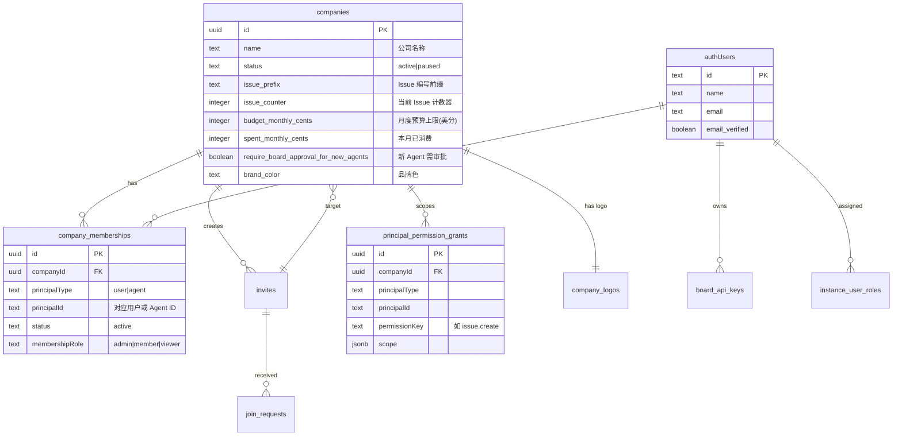

### 3.2 Agent 域

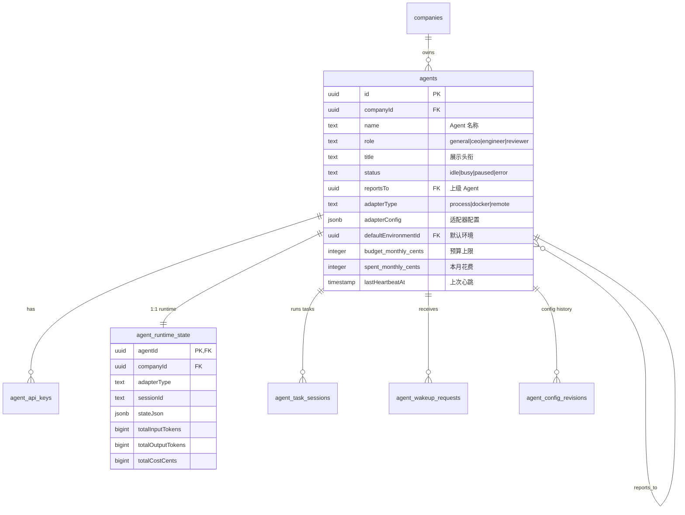

### 3.3 Issue 任务域

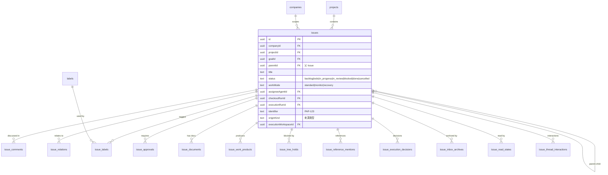

### 3.4 项目与目标域

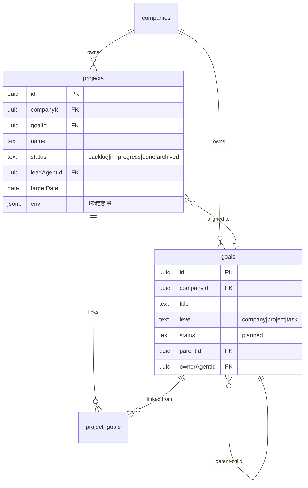

### 3.5 工作空间与环境域

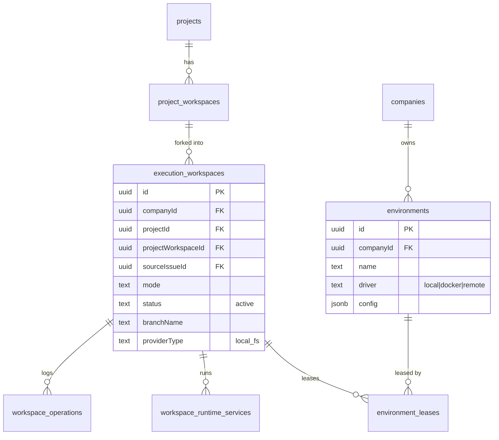

### 3.6 定时任务（Routine）域

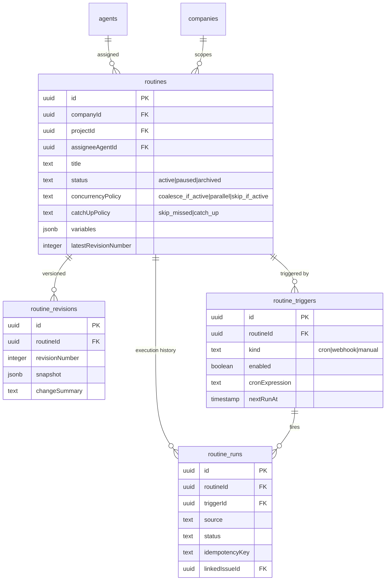

### 3.7 心跳运行域

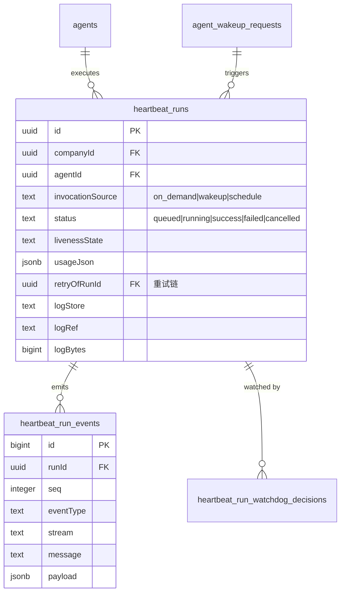

### 3.8 预算与财务域

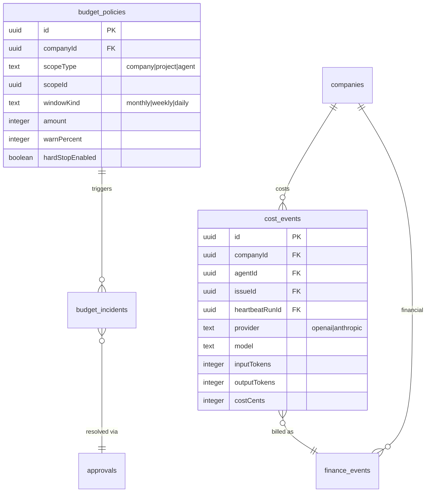

### 3.9 密钥管理域

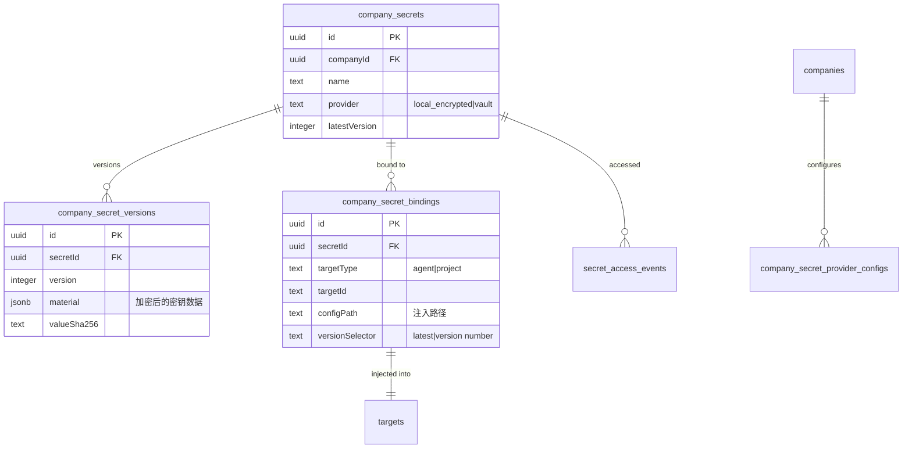

### 3.10 插件系统域

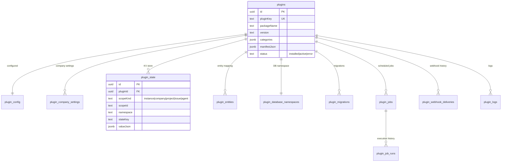

### 3.11 文档与资源域

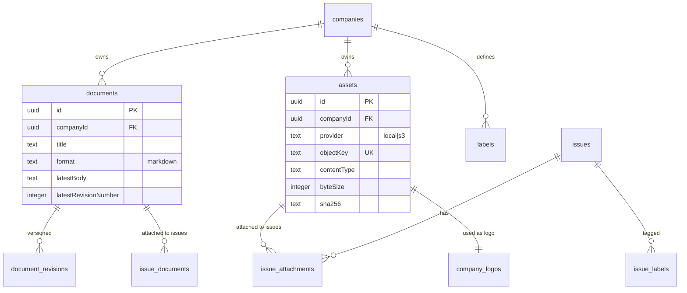

---

## 4. 表定义

### 4.1 组织权限

#### 4.1.1 `companies` — 租户/公司

多租户架构的最高层级。每个公司拥有独立的成员、Agent、项目、预算空间。

| 列 | 类型 | 约束 | 说明 |
|----|------|------|------|
| id | UUID | PK, defaultRandom | 主键 |
| name | TEXT | NOT NULL | 公司名称 |
| description | TEXT | | 公司描述 |
| status | TEXT | NOT NULL, DEFAULT 'active' | active=正常, paused=暂停 |
| pause_reason | TEXT | | 暂停原因 |
| paused_at | TIMESTAMPTZ | | 暂停时间 |
| issue_prefix | TEXT | NOT NULL, DEFAULT 'PAP', UNIQUE | Issue 编号前缀（如 PAP） |
| issue_counter | INTEGER | NOT NULL, DEFAULT 0 | Issue 编号自增计数器 |
| budget_monthly_cents | INTEGER | NOT NULL, DEFAULT 0 | 月度预算上限（美分），0 不限制 |
| spent_monthly_cents | INTEGER | NOT NULL, DEFAULT 0 | 本月已消费（美分） |
| attachment_max_bytes | INTEGER | NOT NULL, DEFAULT 10MB | 附件大小上限 |
| require_board_approval_for_new_agents | BOOLEAN | NOT NULL, DEFAULT false | 新 Agent 加入需审批 |
| feedback_data_sharing_enabled | BOOLEAN | NOT NULL, DEFAULT false | 用户反馈数据共享开关 |
| feedback_data_sharing_consent_at | TIMESTAMPTZ | | 同意共享时间 |
| feedback_data_sharing_consent_by_user_id | TEXT | | 同意用户 ID |
| feedback_data_sharing_terms_version | TEXT | | 同意条款版本 |
| brand_color | TEXT | | 品牌色（十六进制） |
| created_at | TIMESTAMPTZ | NOT NULL, defaultNow | 创建时间 |
| updated_at | TIMESTAMPTZ | NOT NULL, defaultNow | 更新时间 |

#### 4.1.2 `user` (authUsers) — 人类用户

Better Auth 集成，用户身份认证。

| 列 | 类型 | 约束 | 说明 |
|----|------|------|------|
| id | TEXT | PK | 主键 |
| name | TEXT | NOT NULL | 用户名 |
| email | TEXT | NOT NULL | 邮箱 |
| email_verified | BOOLEAN | NOT NULL, DEFAULT false | 邮箱已验证 |
| image | TEXT | | 头像 URL |
| created_at | TIMESTAMPTZ | NOT NULL | 创建时间 |
| updated_at | TIMESTAMPTZ | NOT NULL | 更新时间 |

#### 4.1.3 `session` (authSessions) — 用户会话

| 列 | 类型 | 约束 | 说明 |
|----|------|------|------|
| id | TEXT | PK | 主键 |
| expires_at | TIMESTAMPTZ | NOT NULL | 过期时间 |
| token | TEXT | NOT NULL | 会话令牌 |
| ip_address | TEXT | | IP 地址 |
| user_agent | TEXT | | User-Agent |
| user_id | TEXT | NOT NULL, FK→user | 用户 ID |
| created_at | TIMESTAMPTZ | NOT NULL | 创建时间 |
| updated_at | TIMESTAMPTZ | NOT NULL | 更新时间 |

#### 4.1.4 `account` (authAccounts) — OAuth 账号绑定

| 列 | 类型 | 约束 | 说明 |
|----|------|------|------|
| id | TEXT | PK | 主键 |
| account_id | TEXT | NOT NULL | 第三方账号 ID |
| provider_id | TEXT | NOT NULL | 提供者 ID（github/google） |
| user_id | TEXT | NOT NULL, FK→user | 用户 ID |
| access_token | TEXT | | 访问令牌 |
| refresh_token | TEXT | | 刷新令牌 |
| scope | TEXT | | 授权范围 |
| created_at | TIMESTAMPTZ | NOT NULL | |
| updated_at | TIMESTAMPTZ | NOT NULL | |

#### 4.1.5 `verification` (authVerifications) — 验证码/令牌

| 列 | 类型 | 约束 | 说明 |
|----|------|------|------|
| id | TEXT | PK | |
| identifier | TEXT | NOT NULL | 标识符 |
| value | TEXT | NOT NULL | 验证值 |
| expires_at | TIMESTAMPTZ | NOT NULL | 过期时间 |
| created_at | TIMESTAMPTZ | | |
| updated_at | TIMESTAMPTZ | | |

#### 4.1.6 `company_memberships` — 公司与成员关联

多态关联表，支持用户和 Agent 加入公司。

| 列 | 类型 | 约束 | 说明 |
|----|------|------|------|
| id | UUID | PK, defaultRandom | |
| company_id | UUID | NOT NULL, FK→companies | 公司 |
| principal_type | TEXT | NOT NULL | 主体类型：user/agent |
| principal_id | TEXT | NOT NULL | 主体 ID（用户 ID 或 Agent ID） |
| status | TEXT | NOT NULL, DEFAULT 'active' | 状态 |
| membership_role | TEXT | | 角色：admin/member/viewer |
| created_at | TIMESTAMPTZ | NOT NULL, defaultNow | |
| updated_at | TIMESTAMPTZ | NOT NULL, defaultNow | |

唯一约束: `(company_id, principal_type, principal_id)`

#### 4.1.7 `invites` — 公司邀请

| 列 | 类型 | 约束 | 说明 |
|----|------|------|------|
| id | UUID | PK, defaultRandom | |
| company_id | UUID | FK→companies | 目标公司 |
| invite_type | TEXT | NOT NULL, DEFAULT 'company_join' | 邀请类型 |
| token_hash | TEXT | NOT NULL, UNIQUE | 令牌哈希 |
| allowed_join_types | TEXT | NOT NULL, DEFAULT 'both' | 允许的加入方式 |
| defaults_payload | JSONB | | 默认配置 |
| expires_at | TIMESTAMPTZ | NOT NULL | 过期时间 |
| invited_by_user_id | TEXT | | 邀请人 |
| revoked_at | TIMESTAMPTZ | | 吊销时间 |
| accepted_at | TIMESTAMPTZ | | 接受时间 |
| created_at | TIMESTAMPTZ | NOT NULL, defaultNow | |
| updated_at | TIMESTAMPTZ | NOT NULL, defaultNow | |

#### 4.1.8 `join_requests` — 加入申请

用户或 Agent 接受邀请后提交的加入请求。如需审批则进入 pending_approval 状态。

| 列 | 类型 | 约束 | 说明 |
|----|------|------|------|
| id | UUID | PK, defaultRandom | |
| invite_id | UUID | NOT NULL, FK→invites, UNIQUE | 关联邀请 |
| company_id | UUID | NOT NULL, FK→companies | 目标公司 |
| request_type | TEXT | NOT NULL | 请求类型 |
| status | TEXT | NOT NULL, DEFAULT 'pending_approval' | 状态 |
| request_ip | TEXT | NOT NULL | 请求 IP |
| requesting_user_id | TEXT | | 请求用户 ID |
| agent_name | TEXT | | Agent 名称（Agent 加入时） |
| adapter_type | TEXT | | 适配器类型 |
| capabilities | TEXT | | 能力声明 |
| agent_defaults_payload | JSONB | | Agent 默认配置 |
| claim_secret_hash | TEXT | | 认领密钥哈希 |
| claim_secret_expires_at | TIMESTAMPTZ | | 密钥过期时间 |
| created_agent_id | UUID | FK→agents | 创建后的 Agent ID |
| approved_by_user_id | TEXT | | 审批人 |
| approved_at | TIMESTAMPTZ | | 审批时间 |
| created_at | TIMESTAMPTZ | NOT NULL, defaultNow | |

#### 4.1.9 `instance_settings` — 实例级全局配置（单行模式）

| 列 | 类型 | 约束 | 说明 |
|----|------|------|------|
| id | UUID | PK, defaultRandom | |
| singleton_key | TEXT | NOT NULL, DEFAULT 'default', UNIQUE | 单例键 |
| general | JSONB | NOT NULL, DEFAULT '{}' | 通用配置 |
| experimental | JSONB | NOT NULL, DEFAULT '{}' | 实验性功能开关 |
| created_at | TIMESTAMPTZ | NOT NULL, defaultNow | |
| updated_at | TIMESTAMPTZ | NOT NULL, defaultNow | |

#### 4.1.10 `instance_user_roles` — 实例级用户角色

| 列 | 类型 | 约束 | 说明 |
|----|------|------|------|
| id | UUID | PK, defaultRandom | |
| user_id | TEXT | NOT NULL | 用户 ID |
| role | TEXT | NOT NULL, DEFAULT 'instance_admin' | 角色名 |
| created_at | TIMESTAMPTZ | NOT NULL, defaultNow | |
| updated_at | TIMESTAMPTZ | NOT NULL, defaultNow | |

唯一约束: `(user_id, role)`

#### 4.1.11 `board_api_keys` — 用户 Board API 密钥

| 列 | 类型 | 约束 | 说明 |
|----|------|------|------|
| id | UUID | PK, defaultRandom | |
| user_id | TEXT | NOT NULL, FK→authUsers | 用户 ID |
| name | TEXT | NOT NULL | 密钥名称 |
| key_hash | TEXT | NOT NULL, UNIQUE | SHA-256 哈希 |
| last_used_at | TIMESTAMPTZ | | 最后使用时间 |
| revoked_at | TIMESTAMPTZ | | 吊销时间 |
| expires_at | TIMESTAMPTZ | | 过期时间 |
| created_at | TIMESTAMPTZ | NOT NULL, defaultNow | |

#### 4.1.12 `cli_auth_challenges` — CLI 认证挑战

| 列 | 类型 | 约束 | 说明 |
|----|------|------|------|
| id | UUID | PK, defaultRandom | |
| secret_hash | TEXT | NOT NULL | 挑战密钥哈希 |
| command | TEXT | NOT NULL | CLI 命令 |
| client_name | TEXT | | 客户端名 |
| requested_access | TEXT | NOT NULL, DEFAULT 'board' | 请求的访问级别 |
| requested_company_id | UUID | FK→companies | 目标公司 |
| pending_key_hash | TEXT | NOT NULL | 待创建的密钥哈希 |
| pending_key_name | TEXT | NOT NULL | 待创建的密钥名 |
| approved_by_user_id | TEXT | FK→authUsers | 审批人 |
| board_api_key_id | UUID | FK→boardApiKeys | 创建的 API 密钥 |
| approved_at | TIMESTAMPTZ | | 审批时间 |
| cancelled_at | TIMESTAMPTZ | | 取消时间 |
| expires_at | TIMESTAMPTZ | NOT NULL | 过期时间 |
| created_at | TIMESTAMPTZ | NOT NULL, defaultNow | |

#### 4.1.13 `principal_permission_grants` — 细粒度权限授予

| 列 | 类型 | 约束 | 说明 |
|----|------|------|------|
| id | UUID | PK, defaultRandom | |
| company_id | UUID | NOT NULL, FK→companies | |
| principal_type | TEXT | NOT NULL | 主体类型 |
| principal_id | TEXT | NOT NULL | 主体 ID |
| permission_key | TEXT | NOT NULL | 权限键（如 issue.create） |
| scope | JSONB | | 作用域限制 |
| granted_by_user_id | TEXT | | 授权人 |
| created_at | TIMESTAMPTZ | NOT NULL, defaultNow | |

唯一约束: `(company_id, principal_type, principal_id, permission_key)`

#### 4.1.14 `company_logos` — 公司 Logo

| 列 | 类型 | 约束 | 说明 |
|----|------|------|------|
| id | UUID | PK, defaultRandom | |
| company_id | UUID | NOT NULL, FK→companies, UNIQUE | 公司（最多一个 Logo） |
| asset_id | UUID | NOT NULL, FK→assets, UNIQUE | 资源 ID |
| created_at | TIMESTAMPTZ | NOT NULL, defaultNow | |
| updated_at | TIMESTAMPTZ | NOT NULL, defaultNow | |

#### 4.1.15 `user_sidebar_preferences` — 用户全局侧边栏偏好

| 列 | 类型 | 约束 | 说明 |
|----|------|------|------|
| id | UUID | PK, defaultRandom | |
| user_id | TEXT | NOT NULL, UNIQUE | |
| company_order | JSONB | NOT NULL, DEFAULT '[]' | 公司排序 |
| created_at | TIMESTAMPTZ | NOT NULL, defaultNow | |
| updated_at | TIMESTAMPTZ | NOT NULL, defaultNow | |

#### 4.1.16 `company_user_sidebar_preferences` — 用户公司级侧边栏偏好

| 列 | 类型 | 约束 | 说明 |
|----|------|------|------|
| id | UUID | PK, defaultRandom | |
| company_id | UUID | NOT NULL, FK→companies | |
| user_id | TEXT | NOT NULL | |
| project_order | JSONB | NOT NULL, DEFAULT '[]' | 项目排序 |
| created_at | TIMESTAMPTZ | NOT NULL, defaultNow | |
| updated_at | TIMESTAMPTZ | NOT NULL, defaultNow | |

唯一约束: `(company_id, user_id)`

---

### 4.2 Agent

#### 4.2.1 `agents` — AI Agent 定义

Paperclip 的核心执行单元，由 adapter 驱动，构成树形组织架构。

| 列 | 类型 | 约束 | 说明 |
|----|------|------|------|
| id | UUID | PK, defaultRandom | 主键 |
| company_id | UUID | NOT NULL, FK→companies | 所属公司 |
| name | TEXT | NOT NULL | Agent 名称 |
| role | TEXT | NOT NULL, DEFAULT 'general' | 角色分类：general/ceo/engineer/reviewer |
| title | TEXT | | 展示头衔 |
| icon | TEXT | | 图标标识 |
| status | TEXT | NOT NULL, DEFAULT 'idle' | idle=空闲, busy=忙碌, paused=暂停, error=错误 |
| reports_to | UUID | FK→agents(self) | 上级 Agent ID（树形架构） |
| capabilities | TEXT | | 逗号分隔的能力声明 |
| adapter_type | TEXT | NOT NULL, DEFAULT 'process' | 适配器类型 |
| adapter_config | JSONB | NOT NULL, DEFAULT '{}' | 适配器配置 |
| runtime_config | JSONB | NOT NULL, DEFAULT '{}' | 运行时配置 |
| default_environment_id | UUID | FK→environments | 默认执行环境 |
| budget_monthly_cents | INTEGER | NOT NULL, DEFAULT 0 | Agent 级月度预算上限 |
| spent_monthly_cents | INTEGER | NOT NULL, DEFAULT 0 | 本月花费 |
| pause_reason | TEXT | | 暂停原因 |
| paused_at | TIMESTAMPTZ | | 暂停时间 |
| permissions | JSONB | NOT NULL, DEFAULT '{}' | 细粒度权限 |
| last_heartbeat_at | TIMESTAMPTZ | | 上次心跳 |
| metadata | JSONB | | 元数据 |
| created_at | TIMESTAMPTZ | NOT NULL, defaultNow | |
| updated_at | TIMESTAMPTZ | NOT NULL, defaultNow | |

索引: `agents_company_status_idx(company_id, status)`, `agents_company_reports_to_idx(company_id, reports_to)`

#### 4.2.2 `agent_api_keys` — Agent API 密钥

| 列 | 类型 | 约束 | 说明 |
|----|------|------|------|
| id | UUID | PK, defaultRandom | |
| agent_id | UUID | NOT NULL, FK→agents | 所属 Agent |
| company_id | UUID | NOT NULL, FK→companies | |
| name | TEXT | NOT NULL | 密钥名称 |
| key_hash | TEXT | NOT NULL | SHA-256 哈希（原始密钥不存明文） |
| last_used_at | TIMESTAMPTZ | | 最后使用时间 |
| revoked_at | TIMESTAMPTZ | | 吊销时间（非空=已吊销） |
| created_at | TIMESTAMPTZ | NOT NULL, defaultNow | |

#### 4.2.3 `agent_runtime_state` — Agent 运行时状态（1:1）

与 agents 一对一关联，存储运行时快照。

| 列 | 类型 | 约束 | 说明 |
|----|------|------|------|
| agent_id | UUID | PK, FK→agents | 主键即外键（1:1） |
| company_id | UUID | NOT NULL, FK→companies | |
| adapter_type | TEXT | NOT NULL | 适配器类型 |
| session_id | TEXT | | 当前会话 ID |
| state_json | JSONB | NOT NULL, DEFAULT '{}' | 运行时状态（adapter 特定格式） |
| last_run_id | UUID | | 上次执行 run ID |
| last_run_status | TEXT | | 上次执行状态 |
| total_input_tokens | BIGINT | NOT NULL, DEFAULT 0 | 累计输入 Token |
| total_output_tokens | BIGINT | NOT NULL, DEFAULT 0 | 累计输出 Token |
| total_cached_input_tokens | BIGINT | NOT NULL, DEFAULT 0 | 累计缓存输入 Token |
| total_cost_cents | BIGINT | NOT NULL, DEFAULT 0 | 累计花费（美分） |
| last_error | TEXT | | 最近一次错误 |
| created_at | TIMESTAMPTZ | NOT NULL, defaultNow | |
| updated_at | TIMESTAMPTZ | NOT NULL, defaultNow | |

#### 4.2.4 `agent_config_revisions` — Agent 配置变更历史

| 列 | 类型 | 约束 | 说明 |
|----|------|------|------|
| id | UUID | PK, defaultRandom | |
| company_id | UUID | NOT NULL, FK→companies | |
| agent_id | UUID | NOT NULL, FK→agents | 变更目标 Agent |
| created_by_agent_id | UUID | FK→agents | 变更执行 Agent |
| created_by_user_id | TEXT | | 变更执行用户 |
| source | TEXT | NOT NULL, DEFAULT 'patch' | 变更来源：patch/rollback/initial |
| rolled_back_from_revision_id | UUID | | 回滚来源版本 |
| changed_keys | JSONB | NOT NULL, DEFAULT '[]' | 变更的配置键列表 |
| before_config | JSONB | NOT NULL | 变更前快照 |
| after_config | JSONB | NOT NULL | 变更后快照 |
| created_at | TIMESTAMPTZ | NOT NULL, defaultNow | |

#### 4.2.5 `agent_task_sessions` — Agent 任务级会话

| 列 | 类型 | 约束 | 说明 |
|----|------|------|------|
| id | UUID | PK, defaultRandom | |
| company_id | UUID | NOT NULL, FK→companies | |
| agent_id | UUID | NOT NULL, FK→agents | |
| adapter_type | TEXT | NOT NULL | |
| task_key | TEXT | NOT NULL | 任务键 |
| session_params_json | JSONB | | 会话参数快照 |
| session_display_id | TEXT | | 展示用会话 ID |
| last_run_id | UUID | FK→heartbeatRuns | 上次执行 run |
| last_error | TEXT | | 上次错误 |
| created_at | TIMESTAMPTZ | NOT NULL, defaultNow | |
| updated_at | TIMESTAMPTZ | NOT NULL, defaultNow | |

唯一约束: `(company_id, agent_id, adapter_type, task_key)`

#### 4.2.6 `agent_wakeup_requests` — Agent 唤醒请求队列

| 列 | 类型 | 约束 | 说明 |
|----|------|------|------|
| id | UUID | PK, defaultRandom | |
| company_id | UUID | NOT NULL, FK→companies | |
| agent_id | UUID | NOT NULL, FK→agents | 目标 Agent |
| source | TEXT | NOT NULL | 唤醒来源：routine/issue/manual |
| trigger_detail | TEXT | | 触发详情 |
| reason | TEXT | | 唤醒原因 |
| payload | JSONB | | 请求负载 |
| status | TEXT | NOT NULL, DEFAULT 'queued' | queued/claimed/processing/done/error |
| coalesced_count | INTEGER | NOT NULL, DEFAULT 0 | 合并次数（去重优化） |
| requested_by_actor_type | TEXT | | 请求方类型：user/agent |
| requested_by_actor_id | TEXT | | 请求方 ID |
| idempotency_key | TEXT | | 幂等键 |
| run_id | UUID | | 处理的 heartbeat run |
| requested_at | TIMESTAMPTZ | NOT NULL, defaultNow | |
| claimed_at | TIMESTAMPTZ | | |
| finished_at | TIMESTAMPTZ | | |
| created_at | TIMESTAMPTZ | NOT NULL, defaultNow | |
| updated_at | TIMESTAMPTZ | NOT NULL, defaultNow | |

---

### 4.3 Issue

#### 4.3.1 `issues` — 核心业务编排单元

Issue 是 Paperclip 的核心调度单元，代表一个待完成的工作项。

| 列 | 类型 | 约束 | 说明 |
|----|------|------|------|
| id | UUID | PK, defaultRandom | 主键 |
| company_id | UUID | NOT NULL, FK→companies | 所属公司 |
| project_id | UUID | FK→projects | 关联项目 |
| project_workspace_id | UUID | FK→projectWorkspaces | 项目工作空间 |
| goal_id | UUID | FK→goals | 关联目标 |
| parent_id | UUID | FK→issues(self) | 父 Issue（子任务分解） |
| title | TEXT | NOT NULL | 标题 |
| description | TEXT | | 描述 |
| status | TEXT | NOT NULL, DEFAULT 'backlog' | backlog/todo/in_progress/in_review/blocked/done/cancelled |
| work_mode | TEXT | NOT NULL, DEFAULT 'standard' | standard/monitor/recovery |
| priority | TEXT | NOT NULL, DEFAULT 'medium' | 优先级 |
| assignee_agent_id | UUID | FK→agents | 负责 Agent |
| assignee_user_id | TEXT | | 负责用户 |
| checkout_run_id | UUID | FK→heartbeatRuns | 签出此 Issue 的 run ID |
| execution_run_id | UUID | FK→heartbeatRuns | 执行工作流 run ID |
| execution_agent_name_key | TEXT | | 执行 Agent 名称键 |
| execution_locked_at | TIMESTAMPTZ | | 锁定时间（防并发） |
| created_by_agent_id | UUID | FK→agents | 创建者 Agent |
| created_by_user_id | TEXT | | 创建者用户 |
| issue_number | INTEGER | | 公司级自增序号 |
| identifier | TEXT | UNIQUE | 人类可读标识符（如 PAP-123） |
| origin_kind | TEXT | NOT NULL, DEFAULT 'manual' | 来源类型（manual/routine_execution/...） |
| origin_id | TEXT | | 来源实体 ID |
| origin_run_id | TEXT | | 来源运行 ID |
| origin_fingerprint | TEXT | NOT NULL, DEFAULT 'default' | 来源指纹（用于去重唯一性） |
| request_depth | INTEGER | NOT NULL, DEFAULT 0 | 请求深度（防无限递归） |
| billing_code | TEXT | | 计费代码 |
| assignee_adapter_overrides | JSONB | | 适配器覆盖配置 |
| execution_policy | JSONB | | 执行策略（重试、超时） |
| execution_state | JSONB | | 执行上下文快照（中断恢复） |
| monitor_next_check_at | TIMESTAMPTZ | | 监工下次检查时间 |
| monitor_wake_requested_at | TIMESTAMPTZ | | 监工唤醒请求时间 |
| monitor_last_triggered_at | TIMESTAMPTZ | | 监工上次触发时间 |
| monitor_attempt_count | INTEGER | NOT NULL, DEFAULT 0 | 监工尝试次数 |
| monitor_notes | TEXT | | 监工备注 |
| monitor_scheduled_by | TEXT | | 监工调度者 |
| execution_workspace_id | UUID | FK→executionWorkspaces | 执行工作空间 |
| execution_workspace_preference | TEXT | | 工作空间偏好 auto/reuse/new |
| execution_workspace_settings | JSONB | | 工作空间设置 |
| started_at | TIMESTAMPTZ | | 开始时间 |
| completed_at | TIMESTAMPTZ | | 完成时间 |
| cancelled_at | TIMESTAMPTZ | | 取消时间 |
| hidden_at | TIMESTAMPTZ | | 隐藏时间（软删除） |
| created_at | TIMESTAMPTZ | NOT NULL, defaultNow | |
| updated_at | TIMESTAMPTZ | NOT NULL, defaultNow | |

**重要部分唯一索引**：
- `issues_open_routine_execution_uq` — `(company_id, origin_kind, origin_id, origin_fingerprint)` 例程执行去重
- `issues_active_liveness_recovery_incident_uq` — 活跃活性恢复事件去重
- `issues_identifier_idx` — identifier 唯一索引

#### 4.3.2 `issue_comments` — Issue 评论

| 列 | 类型 | 约束 | 说明 |
|----|------|------|------|
| id | UUID | PK, defaultRandom | |
| company_id | UUID | NOT NULL, FK→companies | |
| issue_id | UUID | NOT NULL, FK→issues | 所属 Issue |
| author_agent_id | UUID | FK→agents | 作者 Agent |
| author_user_id | TEXT | | 作者用户 |
| author_type | TEXT | | 作者类型 |
| created_by_run_id | UUID | FK→heartbeatRuns | 创建者运行 |
| body | TEXT | NOT NULL | 评论内容（支持全文搜索） |
| presentation | JSONB | | 展示格式 |
| metadata | JSONB | | 元数据 |
| created_at | TIMESTAMPTZ | NOT NULL, defaultNow | |
| updated_at | TIMESTAMPTZ | NOT NULL, defaultNow | |

GIN 索引: `issue_comments_body_search_idx(body gin_trgm_ops)`

#### 4.3.3 `issue_relations` — Issue 间关系（阻塞/依赖）

| 列 | 类型 | 约束 | 说明 |
|----|------|------|------|
| id | UUID | PK, defaultRandom | |
| company_id | UUID | NOT NULL, FK→companies | |
| issue_id | UUID | NOT NULL, FK→issues | 源 Issue |
| related_issue_id | UUID | NOT NULL, FK→issues | 目标 Issue |
| type | TEXT | NOT NULL | 关系类型（当前仅 blocks） |
| created_by_agent_id | UUID | FK→agents | |
| created_by_user_id | TEXT | | |
| created_at | TIMESTAMPTZ | NOT NULL, defaultNow | |
| updated_at | TIMESTAMPTZ | NOT NULL, defaultNow | |

唯一约束: `(company_id, issue_id, related_issue_id, type)`

#### 4.3.4 `issue_labels` — Issue 与标签多对多

| 列 | 类型 | 约束 | 说明 |
|----|------|------|------|
| issue_id | UUID | NOT NULL, FK→issues | |
| label_id | UUID | NOT NULL, FK→labels | |
| company_id | UUID | NOT NULL, FK→companies | |
| created_at | TIMESTAMPTZ | NOT NULL, defaultNow | |

主键: `(issue_id, label_id)`

#### 4.3.5 `issue_approvals` — Issue 与审批多对多

| 列 | 类型 | 约束 | 说明 |
|----|------|------|------|
| company_id | UUID | NOT NULL, FK→companies | |
| issue_id | UUID | NOT NULL, FK→issues | |
| approval_id | UUID | NOT NULL, FK→approvals | |
| linked_by_agent_id | UUID | FK→agents | |
| linked_by_user_id | TEXT | | |
| created_at | TIMESTAMPTZ | NOT NULL, defaultNow | |

主键: `(issue_id, approval_id)`

#### 4.3.6 `issue_attachments` — Issue 附件关联

| 列 | 类型 | 约束 | 说明 |
|----|------|------|------|
| id | UUID | PK, defaultRandom | |
| company_id | UUID | NOT NULL, FK→companies | |
| issue_id | UUID | NOT NULL, FK→issues | |
| asset_id | UUID | NOT NULL, FK→assets, UNIQUE | 资源（一个资源只能附属于一个 Issue） |
| issue_comment_id | UUID | FK→issueComments | 可选关联到具体评论 |
| created_at | TIMESTAMPTZ | NOT NULL, defaultNow | |
| updated_at | TIMESTAMPTZ | NOT NULL, defaultNow | |

#### 4.3.7 `issue_documents` — Issue 关联文档

| 列 | 类型 | 约束 | 说明 |
|----|------|------|------|
| id | UUID | PK, defaultRandom | |
| company_id | UUID | NOT NULL, FK→companies | |
| issue_id | UUID | NOT NULL, FK→issues | |
| document_id | UUID | NOT NULL, FK→documents, UNIQUE | 文档（一个文档只能属于一个 Issue） |
| key | TEXT | NOT NULL | 角色键 |
| created_at | TIMESTAMPTZ | NOT NULL, defaultNow | |
| updated_at | TIMESTAMPTZ | NOT NULL, defaultNow | |

唯一约束: `(company_id, issue_id, key)`

#### 4.3.8 `issue_execution_decisions` — Issue 执行决策记录

| 列 | 类型 | 约束 | 说明 |
|----|------|------|------|
| id | UUID | PK, defaultRandom | |
| company_id | UUID | NOT NULL, FK→companies | |
| issue_id | UUID | NOT NULL, FK→issues | |
| stage_id | UUID | NOT NULL | 决策阶段 ID |
| stage_type | TEXT | NOT NULL | 阶段类型 |
| actor_agent_id | UUID | FK→agents | 决策 Agent |
| actor_user_id | TEXT | | 决策用户 |
| outcome | TEXT | NOT NULL | 决策结果 |
| body | TEXT | NOT NULL | 决策内容 |
| created_by_run_id | UUID | FK→heartbeatRuns | |
| created_at | TIMESTAMPTZ | NOT NULL, defaultNow | |
| updated_at | TIMESTAMPTZ | NOT NULL, defaultNow | |

#### 4.3.9 `issue_inbox_archives` — 用户收件箱归档

| 列 | 类型 | 约束 | 说明 |
|----|------|------|------|
| id | UUID | PK, defaultRandom | |
| company_id | UUID | NOT NULL, FK→companies | |
| issue_id | UUID | NOT NULL, FK→issues | |
| user_id | TEXT | NOT NULL | |
| archived_at | TIMESTAMPTZ | NOT NULL, defaultNow | |
| created_at | TIMESTAMPTZ | NOT NULL, defaultNow | |
| updated_at | TIMESTAMPTZ | NOT NULL, defaultNow | |

唯一约束: `(company_id, issue_id, user_id)`

#### 4.3.10 `issue_read_states` — 用户 Issue 阅读状态

| 列 | 类型 | 约束 | 说明 |
|----|------|------|------|
| id | UUID | PK, defaultRandom | |
| company_id | UUID | NOT NULL, FK→companies | |
| issue_id | UUID | NOT NULL, FK→issues | |
| user_id | TEXT | NOT NULL | |
| last_read_at | TIMESTAMPTZ | NOT NULL, defaultNow | 最后阅读时间 |
| created_at | TIMESTAMPTZ | NOT NULL, defaultNow | |
| updated_at | TIMESTAMPTZ | NOT NULL, defaultNow | |

唯一约束: `(company_id, issue_id, user_id)`

#### 4.3.11 `issue_reference_mentions` — Issue 引用/提及关系

| 列 | 类型 | 约束 | 说明 |
|----|------|------|------|
| id | UUID | PK, defaultRandom | |
| company_id | UUID | NOT NULL, FK→companies | |
| source_issue_id | UUID | NOT NULL, FK→issues | 源 Issue |
| target_issue_id | UUID | NOT NULL, FK→issues | 被引用 Issue |
| source_kind | TEXT | NOT NULL | 引用来源：title/description/comment/document |
| source_record_id | UUID | | 来源记录 ID |
| document_key | TEXT | | 文档键 |
| matched_text | TEXT | | 匹配的文本 |
| created_at | TIMESTAMPTZ | NOT NULL, defaultNow | |
| updated_at | TIMESTAMPTZ | NOT NULL, defaultNow | |

部分唯一索引: 根据 source_record_id 是否为空分别建立唯一约束

#### 4.3.12 `issue_thread_interactions` — Issue 线程交互（Agent-用户对话）

| 列 | 类型 | 约束 | 说明 |
|----|------|------|------|
| id | UUID | PK, defaultRandom | |
| company_id | UUID | NOT NULL, FK→companies | |
| issue_id | UUID | NOT NULL, FK→issues | |
| kind | TEXT | NOT NULL | 交互类型 |
| status | TEXT | NOT NULL, DEFAULT 'pending' | pending/resolved |
| continuation_policy | TEXT | NOT NULL, DEFAULT 'wake_assignee' | 续接策略 |
| idempotency_key | TEXT | | 幂等键 |
| source_comment_id | UUID | FK→issueComments | 触发评论 |
| source_run_id | UUID | FK→heartbeatRuns | 触发运行 |
| title | TEXT | | 标题 |
| summary | TEXT | | 摘要 |
| created_by_agent_id | UUID | FK→agents | |
| created_by_user_id | TEXT | | |
| resolved_by_agent_id | UUID | FK→agents | |
| resolved_by_user_id | TEXT | | |
| payload | JSONB | NOT NULL | 交互负载 |
| result | JSONB | | 交互结果 |
| resolved_at | TIMESTAMPTZ | | |
| created_at | TIMESTAMPTZ | NOT NULL, defaultNow | |
| updated_at | TIMESTAMPTZ | NOT NULL, defaultNow | |

#### 4.3.13 `issue_tree_holds` — Issue 树阻塞/暂停

用于暂停整个 Issue 子树（父 Issue + 所有子任务）的执行。

| 列 | 类型 | 约束 | 说明 |
|----|------|------|------|
| id | UUID | PK, defaultRandom | |
| company_id | UUID | NOT NULL, FK→companies | |
| root_issue_id | UUID | NOT NULL, FK→issues | 根 Issue |
| mode | TEXT | NOT NULL | 阻塞模式 |
| status | TEXT | NOT NULL, DEFAULT 'active' | active/released |
| reason | TEXT | | 原因 |
| release_policy | JSONB | | 释放策略 |
| created_by_actor_type | TEXT | NOT NULL, DEFAULT 'system' | |
| created_by_agent_id | UUID | FK→agents | |
| created_by_user_id | TEXT | | |
| created_by_run_id | UUID | FK→heartbeatRuns | |
| released_at | TIMESTAMPTZ | | 释放时间 |
| released_by_actor_type | TEXT | | |
| released_by_agent_id | UUID | FK→agents | |
| released_by_user_id | TEXT | | |
| released_by_run_id | UUID | FK→heartbeatRuns | |
| release_reason | TEXT | | |
| release_metadata | JSONB | | |
| created_at | TIMESTAMPTZ | NOT NULL, defaultNow | |
| updated_at | TIMESTAMPTZ | NOT NULL, defaultNow | |

#### 4.3.14 `issue_tree_hold_members` — 树阻塞成员 Issue

| 列 | 类型 | 约束 | 说明 |
|----|------|------|------|
| id | UUID | PK, defaultRandom | |
| company_id | UUID | NOT NULL, FK→companies | |
| hold_id | UUID | NOT NULL, FK→issueTreeHolds | |
| issue_id | UUID | NOT NULL, FK→issues | |
| parent_issue_id | UUID | FK→issues | |
| depth | INTEGER | NOT NULL, DEFAULT 0 | 在树中的深度 |
| issue_identifier | TEXT | | Issue 标识符快照 |
| issue_title | TEXT | NOT NULL | 标题快照 |
| issue_status | TEXT | NOT NULL | 状态快照 |
| assignee_agent_id | UUID | FK→agents | |
| assignee_user_id | TEXT | | |
| active_run_id | UUID | FK→heartbeatRuns | |
| active_run_status | TEXT | | |
| skipped | BOOLEAN | NOT NULL, DEFAULT false | 是否跳过 |
| skip_reason | TEXT | | |
| created_at | TIMESTAMPTZ | NOT NULL, defaultNow | |

唯一约束: `(hold_id, issue_id)`

#### 4.3.15 `issue_work_products` — Issue 产出物（PR、部署等）

| 列 | 类型 | 约束 | 说明 |
|----|------|------|------|
| id | UUID | PK, defaultRandom | |
| company_id | UUID | NOT NULL, FK→companies | |
| project_id | UUID | FK→projects | |
| issue_id | UUID | NOT NULL, FK→issues | |
| execution_workspace_id | UUID | FK→executionWorkspaces | |
| runtime_service_id | UUID | FK→workspaceRuntimeServices | |
| type | TEXT | NOT NULL | 产出类型 |
| provider | TEXT | NOT NULL | 提供者（github/vercel 等） |
| external_id | TEXT | | 外部 ID |
| title | TEXT | NOT NULL | 标题 |
| url | TEXT | | 外部 URL |
| status | TEXT | NOT NULL | 状态 |
| review_state | TEXT | NOT NULL, DEFAULT 'none' | 审查状态 |
| is_primary | BOOLEAN | NOT NULL, DEFAULT false | 是否为主要产出物 |
| health_status | TEXT | NOT NULL, DEFAULT 'unknown' | 健康状态 |
| summary | TEXT | | 摘要 |
| metadata | JSONB | | |
| created_by_run_id | UUID | FK→heartbeatRuns | |
| created_at | TIMESTAMPTZ | NOT NULL, defaultNow | |
| updated_at | TIMESTAMPTZ | NOT NULL, defaultNow | |

---

### 4.4 项目与目标

#### 4.4.1 `projects` — 项目定义

| 列 | 类型 | 约束 | 说明 |
|----|------|------|------|
| id | UUID | PK, defaultRandom | |
| company_id | UUID | NOT NULL, FK→companies | |
| goal_id | UUID | FK→goals | 关联目标 |
| name | TEXT | NOT NULL | 项目名称 |
| description | TEXT | | 描述 |
| status | TEXT | NOT NULL, DEFAULT 'backlog' | backlog/in_progress/done/archived |
| lead_agent_id | UUID | FK→agents | 负责人 Agent |
| target_date | DATE | | 目标日期 |
| color | TEXT | | 颜色 |
| env | JSONB | | 环境变量注入 |
| pause_reason | TEXT | | |
| paused_at | TIMESTAMPTZ | | |
| execution_workspace_policy | JSONB | | 执行工作空间策略 |
| archived_at | TIMESTAMPTZ | | 归档时间 |
| created_at | TIMESTAMPTZ | NOT NULL, defaultNow | |
| updated_at | TIMESTAMPTZ | NOT NULL, defaultNow | |

#### 4.4.2 `goals` — 目标/OKR 定义

| 列 | 类型 | 约束 | 说明 |
|----|------|------|------|
| id | UUID | PK, defaultRandom | |
| company_id | UUID | NOT NULL, FK→companies | |
| title | TEXT | NOT NULL | 目标标题 |
| description | TEXT | | 描述 |
| level | TEXT | NOT NULL, DEFAULT 'task' | company/project/task |
| status | TEXT | NOT NULL, DEFAULT 'planned' | |
| parent_id | UUID | FK→goals(self) | 父目标 |
| owner_agent_id | UUID | FK→agents | 负责人 |
| created_at | TIMESTAMPTZ | NOT NULL, defaultNow | |
| updated_at | TIMESTAMPTZ | NOT NULL, defaultNow | |

#### 4.4.3 `project_goals` — 项目与目标多对多

| 列 | 类型 | 约束 | 说明 |
|----|------|------|------|
| project_id | UUID | NOT NULL, FK→projects | |
| goal_id | UUID | NOT NULL, FK→goals | |
| company_id | UUID | NOT NULL, FK→companies | |
| created_at | TIMESTAMPTZ | NOT NULL, defaultNow | |
| updated_at | TIMESTAMPTZ | NOT NULL, defaultNow | |

主键: `(project_id, goal_id)`

---

### 4.5 工作空间与环境

#### 4.5.1 `project_workspaces` — 项目工作空间定义

| 列 | 类型 | 约束 | 说明 |
|----|------|------|------|
| id | UUID | PK, defaultRandom | |
| company_id | UUID | NOT NULL, FK→companies | |
| project_id | UUID | NOT NULL, FK→projects | |
| name | TEXT | NOT NULL | 名称 |
| source_type | TEXT | NOT NULL, DEFAULT 'local_path' | local_path/github 等 |
| cwd | TEXT | | 工作目录 |
| repo_url | TEXT | | 仓库 URL |
| repo_ref | TEXT | | 仓库引用 |
| default_ref | TEXT | | 默认分支 |
| visibility | TEXT | NOT NULL, DEFAULT 'default' | 可见性 |
| setup_command | TEXT | | 设置命令 |
| cleanup_command | TEXT | | 清理命令 |
| remote_provider | TEXT | | 远程提供者 |
| remote_workspace_ref | TEXT | | 远程工作空间引用 |
| shared_workspace_key | TEXT | | 共享工作空间键 |
| metadata | JSONB | | |
| is_primary | BOOLEAN | NOT NULL, DEFAULT false | 是否主工作空间 |
| created_at | TIMESTAMPTZ | NOT NULL, defaultNow | |
| updated_at | TIMESTAMPTZ | NOT NULL, defaultNow | |

#### 4.5.2 `execution_workspaces` — 运行时工作空间（执行沙箱）

从项目工作空间 fork 出的执行环境。

| 列 | 类型 | 约束 | 说明 |
|----|------|------|------|
| id | UUID | PK, defaultRandom | |
| company_id | UUID | NOT NULL, FK→companies | |
| project_id | UUID | NOT NULL, FK→projects | |
| project_workspace_id | UUID | FK→projectWorkspaces | |
| source_issue_id | UUID | FK→issues | 触发 Issue |
| mode | TEXT | NOT NULL | 模式 |
| strategy_type | TEXT | NOT NULL | 策略类型 |
| name | TEXT | NOT NULL | 名称 |
| status | TEXT | NOT NULL, DEFAULT 'active' | active/closed |
| cwd | TEXT | | 工作目录 |
| repo_url | TEXT | | 仓库 URL |
| base_ref | TEXT | | 基础分支 |
| branch_name | TEXT | | 分支名 |
| provider_type | TEXT | NOT NULL, DEFAULT 'local_fs' | 提供者类型 |
| provider_ref | TEXT | | 提供者引用 |
| derived_from_execution_workspace_id | UUID | FK→executionWorkspaces(self) | 派生来源 |
| last_used_at | TIMESTAMPTZ | NOT NULL, defaultNow | |
| opened_at | TIMESTAMPTZ | NOT NULL, defaultNow | |
| closed_at | TIMESTAMPTZ | | |
| cleanup_eligible_at | TIMESTAMPTZ | | 可清理时间 |
| cleanup_reason | TEXT | | |
| metadata | JSONB | | |
| created_at | TIMESTAMPTZ | NOT NULL, defaultNow | |
| updated_at | TIMESTAMPTZ | NOT NULL, defaultNow | |

#### 4.5.3 `environments` — 执行环境配置

| 列 | 类型 | 约束 | 说明 |
|----|------|------|------|
| id | UUID | PK, defaultRandom | |
| company_id | UUID | NOT NULL, FK→companies | |
| name | TEXT | NOT NULL | 环境名称 |
| description | TEXT | | 描述 |
| driver | TEXT | NOT NULL, DEFAULT 'local' | 驱动类型（local/docker/remote） |
| status | TEXT | NOT NULL, DEFAULT 'active' | |
| config | JSONB | NOT NULL, DEFAULT '{}' | 驱动配置 |
| metadata | JSONB | | |
| created_at | TIMESTAMPTZ | NOT NULL, defaultNow | |
| updated_at | TIMESTAMPTZ | NOT NULL, defaultNow | |

部分唯一索引: `(company_id, driver) WHERE driver = 'local'`（每公司唯一 local 环境）

#### 4.5.4 `environment_leases` — 环境租约管理

| 列 | 类型 | 约束 | 说明 |
|----|------|------|------|
| id | UUID | PK, defaultRandom | |
| company_id | UUID | NOT NULL, FK→companies | |
| environment_id | UUID | NOT NULL, FK→environments | |
| execution_workspace_id | UUID | FK→executionWorkspaces | |
| issue_id | UUID | FK→issues | |
| heartbeat_run_id | UUID | FK→heartbeatRuns | |
| status | TEXT | NOT NULL, DEFAULT 'active' | |
| lease_policy | TEXT | NOT NULL, DEFAULT 'ephemeral' | ephemeral=任务完释放, persistent=保持分配 |
| provider | TEXT | | 提供者 |
| provider_lease_id | TEXT | | 提供者租约 ID |
| acquired_at | TIMESTAMPTZ | NOT NULL, defaultNow | |
| last_used_at | TIMESTAMPTZ | NOT NULL, defaultNow | |
| expires_at | TIMESTAMPTZ | | 到期时间 |
| released_at | TIMESTAMPTZ | | |
| failure_reason | TEXT | | |
| cleanup_status | TEXT | | |
| metadata | JSONB | | |
| created_at | TIMESTAMPTZ | NOT NULL, defaultNow | |
| updated_at | TIMESTAMPTZ | NOT NULL, defaultNow | |

#### 4.5.5 `workspace_operations` — 工作空间操作日志

| 列 | 类型 | 约束 | 说明 |
|----|------|------|------|
| id | UUID | PK, defaultRandom | |
| company_id | UUID | NOT NULL, FK→companies | |
| execution_workspace_id | UUID | FK→executionWorkspaces | |
| heartbeat_run_id | UUID | FK→heartbeatRuns | |
| phase | TEXT | NOT NULL | 执行阶段 |
| command | TEXT | | 执行的命令 |
| cwd | TEXT | | 工作目录 |
| status | TEXT | NOT NULL, DEFAULT 'running' | |
| exit_code | INTEGER | | 退出码 |
| log_store | TEXT | | 日志存储 |
| log_ref | TEXT | | 日志引用 |
| log_bytes | BIGINT | | 日志字节数 |
| log_sha256 | TEXT | | 日志哈希 |
| log_compressed | BOOLEAN | NOT NULL, DEFAULT false | |
| stdout_excerpt | TEXT | | 标准输出摘录 |
| stderr_excerpt | TEXT | | 标准错误摘录 |
| metadata | JSONB | | |
| started_at | TIMESTAMPTZ | NOT NULL, defaultNow | |
| finished_at | TIMESTAMPTZ | | |
| created_at | TIMESTAMPTZ | NOT NULL, defaultNow | |
| updated_at | TIMESTAMPTZ | NOT NULL, defaultNow | |

#### 4.5.6 `workspace_runtime_services` — 工作空间运行时服务

Agent 执行期间启动的持久化服务（数据库、Web 服务等）。

| 列 | 类型 | 约束 | 说明 |
|----|------|------|------|
| id | UUID | PK | |
| company_id | UUID | NOT NULL, FK→companies | |
| project_id | UUID | FK→projects | |
| project_workspace_id | UUID | FK→projectWorkspaces | |
| execution_workspace_id | UUID | FK→executionWorkspaces | |
| issue_id | UUID | FK→issues | |
| scope_type | TEXT | NOT NULL | 作用域类型 |
| scope_id | TEXT | | 作用域 ID |
| service_name | TEXT | NOT NULL | 服务名称 |
| status | TEXT | NOT NULL | 状态 |
| lifecycle | TEXT | NOT NULL | 生命周期 |
| reuse_key | TEXT | | 复用键 |
| command | TEXT | | 启动命令 |
| cwd | TEXT | | 工作目录 |
| port | INTEGER | | 端口 |
| url | TEXT | | URL |
| provider | TEXT | NOT NULL | 提供者 |
| provider_ref | TEXT | | 提供者引用 |
| owner_agent_id | UUID | FK→agents | |
| started_by_run_id | UUID | FK→heartbeatRuns | |
| last_used_at | TIMESTAMPTZ | NOT NULL, defaultNow | |
| started_at | TIMESTAMPTZ | NOT NULL, defaultNow | |
| stopped_at | TIMESTAMPTZ | | |
| stop_policy | JSONB | | 停止策略 |
| health_status | TEXT | NOT NULL, DEFAULT 'unknown' | |
| created_at | TIMESTAMPTZ | NOT NULL, defaultNow | |
| updated_at | TIMESTAMPTZ | NOT NULL, defaultNow | |

---

### 4.6 定时任务（Routine）

#### 4.6.1 `routines` — 定时任务/自动化流程定义

Routine 是 Paperclip 的定时工作流引擎，类似增强版 Cron Job。

| 列 | 类型 | 约束 | 说明 |
|----|------|------|------|
| id | UUID | PK, defaultRandom | |
| company_id | UUID | NOT NULL, FK→companies | |
| project_id | UUID | FK→projects | |
| goal_id | UUID | FK→goals | |
| parent_issue_id | UUID | FK→issues | 关联的父 Issue |
| title | TEXT | NOT NULL | |
| description | TEXT | | |
| assignee_agent_id | UUID | FK→agents | 负责 Agent |
| priority | TEXT | NOT NULL, DEFAULT 'medium' | |
| status | TEXT | NOT NULL, DEFAULT 'active' | active/paused/archived |
| concurrency_policy | TEXT | NOT NULL, DEFAULT 'coalesce_if_active' | coalesce_if_active/parallel/skip_if_active |
| catch_up_policy | TEXT | NOT NULL, DEFAULT 'skip_missed' | skip_missed/catch_up |
| variables | JSONB | NOT NULL, DEFAULT '[]' | 变量定义 |
| latest_revision_id | UUID | | 最新版本 ID |
| latest_revision_number | INTEGER | NOT NULL, DEFAULT 1 | |
| created_by_agent_id | UUID | FK→agents | |
| created_by_user_id | TEXT | | |
| updated_by_agent_id | UUID | FK→agents | |
| updated_by_user_id | TEXT | | |
| last_triggered_at | TIMESTAMPTZ | | |
| last_enqueued_at | TIMESTAMPTZ | | |
| created_at | TIMESTAMPTZ | NOT NULL, defaultNow | |
| updated_at | TIMESTAMPTZ | NOT NULL, defaultNow | |

#### 4.6.2 `routine_revisions` — Routine 版本快照历史

| 列 | 类型 | 约束 | 说明 |
|----|------|------|------|
| id | UUID | PK, defaultRandom | |
| company_id | UUID | NOT NULL, FK→companies | |
| routine_id | UUID | NOT NULL, FK→routines | |
| revision_number | INTEGER | NOT NULL | 版本号 |
| title | TEXT | NOT NULL | |
| description | TEXT | | |
| snapshot | JSONB | NOT NULL | 完整版本快照 |
| change_summary | TEXT | | 变更摘要 |
| restored_from_revision_id | UUID | FK→routineRevisions(self) | |
| created_by_agent_id | UUID | FK→agents | |
| created_by_user_id | TEXT | | |
| created_by_run_id | UUID | FK→heartbeatRuns | |
| created_at | TIMESTAMPTZ | NOT NULL, defaultNow | |

唯一约束: `(routine_id, revision_number)`

#### 4.6.3 `routine_triggers` — Routine 触发器配置

支持 cron、webhook、manual 三种触发方式。一个 Routine 可以有多个触发器。

| 列 | 类型 | 约束 | 说明 |
|----|------|------|------|
| id | UUID | PK, defaultRandom | |
| company_id | UUID | NOT NULL, FK→companies | |
| routine_id | UUID | NOT NULL, FK→routines | |
| kind | TEXT | NOT NULL | cron/webhook/manual |
| label | TEXT | | 标签 |
| enabled | BOOLEAN | NOT NULL, DEFAULT true | |
| cron_expression | TEXT | | Cron 表达式 |
| timezone | TEXT | | 时区 |
| next_run_at | TIMESTAMPTZ | | 下次执行时间 |
| last_fired_at | TIMESTAMPTZ | | |
| public_id | TEXT | | Webhook 公开 ID |
| secret_id | UUID | FK→companySecrets | Webhook 签名密钥 |
| signing_mode | TEXT | | 签名模式 |
| replay_window_sec | INTEGER | | 回放窗口（秒） |
| last_rotated_at | TIMESTAMPTZ | | |
| last_result | TEXT | | |
| created_by_agent_id | UUID | FK→agents | |
| created_by_user_id | TEXT | | |
| updated_by_agent_id | UUID | FK→agents | |
| updated_by_user_id | TEXT | | |
| created_at | TIMESTAMPTZ | NOT NULL, defaultNow | |
| updated_at | TIMESTAMPTZ | NOT NULL, defaultNow | |

#### 4.6.4 `routine_runs` — Routine 执行历史

| 列 | 类型 | 约束 | 说明 |
|----|------|------|------|
| id | UUID | PK, defaultRandom | |
| company_id | UUID | NOT NULL, FK→companies | |
| routine_id | UUID | NOT NULL, FK→routines | |
| trigger_id | UUID | FK→routineTriggers | |
| source | TEXT | NOT NULL | 触发源 |
| status | TEXT | NOT NULL, DEFAULT 'received' | |
| triggered_at | TIMESTAMPTZ | NOT NULL, defaultNow | |
| idempotency_key | TEXT | | 幂等键 |
| trigger_payload | JSONB | | 触发负载 |
| dispatch_fingerprint | TEXT | | 分发指纹 |
| linked_issue_id | UUID | FK→issues | |
| coalesced_into_run_id | UUID | | 合并到的 run ID |
| failure_reason | TEXT | | |
| completed_at | TIMESTAMPTZ | | |
| created_at | TIMESTAMPTZ | NOT NULL, defaultNow | |
| updated_at | TIMESTAMPTZ | NOT NULL, defaultNow | |

---

### 4.7 心跳运行

#### 4.7.1 `heartbeat_runs` — Agent 心跳运行记录（核心执行追踪表）

每次心跳循环的一次完整执行。追踪进程信息、输出日志、错误处理和重试机制。

| 列 | 类型 | 约束 | 说明 |
|----|------|------|------|
| id | UUID | PK, defaultRandom | |
| company_id | UUID | NOT NULL, FK→companies | |
| agent_id | UUID | NOT NULL, FK→agents | 执行 Agent |
| invocation_source | TEXT | NOT NULL, DEFAULT 'on_demand' | on_demand/wakeup/schedule |
| trigger_detail | TEXT | | 触发详情 |
| status | TEXT | NOT NULL, DEFAULT 'queued' | queued/running/success/failed/cancelled |
| started_at | TIMESTAMPTZ | | |
| finished_at | TIMESTAMPTZ | | |
| error | TEXT | | 错误消息 |
| wakeup_request_id | UUID | FK→agentWakeupRequests | |
| exit_code | INTEGER | | 进程退出码 |
| signal | TEXT | | 终止信号 |
| usage_json | JSONB | | Token 用量 |
| result_json | JSONB | | 执行结果 |
| session_id_before | TEXT | | 运行前会话 ID |
| session_id_after | TEXT | | 运行后会话 ID |
| log_store | TEXT | | 日志存储 |
| log_ref | TEXT | | 日志引用 |
| log_bytes | BIGINT | | |
| log_sha256 | TEXT | | |
| log_compressed | BOOLEAN | NOT NULL, DEFAULT false | |
| stdout_excerpt | TEXT | | |
| stderr_excerpt | TEXT | | |
| error_code | TEXT | | |
| external_run_id | TEXT | | |
| process_pid | INTEGER | | 进程 PID |
| process_group_id | INTEGER | | |
| process_started_at | TIMESTAMPTZ | | |
| last_output_at | TIMESTAMPTZ | | |
| last_output_seq | INTEGER | NOT NULL, DEFAULT 0 | |
| last_output_stream | TEXT | | |
| last_output_bytes | BIGINT | | |
| retry_of_run_id | UUID | FK→heartbeatRuns(self) | 被重试的原 run |
| process_loss_retry_count | INTEGER | NOT NULL, DEFAULT 0 | |
| scheduled_retry_at | TIMESTAMPTZ | | |
| scheduled_retry_attempt | INTEGER | NOT NULL, DEFAULT 0 | |
| scheduled_retry_reason | TEXT | | |
| issue_comment_status | TEXT | NOT NULL, DEFAULT 'not_applicable' | 评论状态 |
| issue_comment_satisfied_by_comment_id | UUID | | |
| issue_comment_retry_queued_at | TIMESTAMPTZ | | |
| liveness_state | TEXT | | 健康状态 |
| liveness_reason | TEXT | | |
| continuation_attempt | INTEGER | NOT NULL, DEFAULT 0 | 连续执行次数 |
| last_useful_action_at | TIMESTAMPTZ | | 最后有意义操作时间 |
| next_action | TEXT | | 下次动作提示 |
| context_snapshot | JSONB | | 上下文快照（恢复长时间运行） |
| created_at | TIMESTAMPTZ | NOT NULL, defaultNow | |
| updated_at | TIMESTAMPTZ | NOT NULL, defaultNow | |

#### 4.7.2 `heartbeat_run_events` — Agent 运行事件日志流

| 列 | 类型 | 约束 | 说明 |
|----|------|------|------|
| id | BIGSERIAL | PK | 自增主键（事件量大的使用序列） |
| company_id | UUID | NOT NULL, FK→companies | |
| run_id | UUID | NOT NULL, FK→heartbeatRuns | |
| agent_id | UUID | NOT NULL, FK→agents | |
| seq | INTEGER | NOT NULL | 事件序号 |
| event_type | TEXT | NOT NULL | 事件类型 |
| stream | TEXT | | 流 |
| level | TEXT | | 日志级别 |
| color | TEXT | | 颜色（UI 展示） |
| message | TEXT | | 消息 |
| payload | JSONB | | 负载 |
| created_at | TIMESTAMPTZ | NOT NULL, defaultNow | |

#### 4.7.3 `heartbeat_run_watchdog_decisions` — 看门狗决策记录

| 列 | 类型 | 约束 | 说明 |
|----|------|------|------|
| id | UUID | PK, defaultRandom | |
| company_id | UUID | NOT NULL, FK→companies | |
| run_id | UUID | NOT NULL, FK→heartbeatRuns | |
| evaluation_issue_id | UUID | FK→issues | |
| decision | TEXT | NOT NULL | |
| snoozed_until | TIMESTAMPTZ | | 静默到 |
| reason | TEXT | | |
| created_by_agent_id | UUID | FK→agents | |
| created_by_user_id | TEXT | | |
| created_by_run_id | UUID | FK→heartbeatRuns | |
| created_at | TIMESTAMPTZ | NOT NULL, defaultNow | |

---

### 4.8 预算与财务

#### 4.8.1 `budget_policies` — 预算策略配置

| 列 | 类型 | 约束 | 说明 |
|----|------|------|------|
| id | UUID | PK, defaultRandom | |
| company_id | UUID | NOT NULL, FK→companies | |
| scope_type | TEXT | NOT NULL | 作用域类型（company/project/agent） |
| scope_id | UUID | NOT NULL | 作用域 ID |
| metric | TEXT | NOT NULL, DEFAULT 'billed_cents' | 监控指标 |
| window_kind | TEXT | NOT NULL | 时间窗口（monthly/weekly/daily） |
| amount | INTEGER | NOT NULL, DEFAULT 0 | 金额上限 |
| warn_percent | INTEGER | NOT NULL, DEFAULT 80 | 告警百分比 |
| hard_stop_enabled | BOOLEAN | NOT NULL, DEFAULT true | 达到上限自动暂停 |
| notify_enabled | BOOLEAN | NOT NULL, DEFAULT true | |
| is_active | BOOLEAN | NOT NULL, DEFAULT true | |
| created_by_user_id | TEXT | | |
| updated_by_user_id | TEXT | | |
| created_at | TIMESTAMPTZ | NOT NULL, defaultNow | |
| updated_at | TIMESTAMPTZ | NOT NULL, defaultNow | |

唯一约束: `(company_id, scope_type, scope_id, metric, window_kind)`

#### 4.8.2 `budget_incidents` — 预算违规事件

| 列 | 类型 | 约束 | 说明 |
|----|------|------|------|
| id | UUID | PK, defaultRandom | |
| company_id | UUID | NOT NULL, FK→companies | |
| policy_id | UUID | NOT NULL, FK→budgetPolicies | |
| scope_type | TEXT | NOT NULL | |
| scope_id | UUID | NOT NULL | |
| metric | TEXT | NOT NULL | |
| window_kind | TEXT | NOT NULL | |
| window_start | TIMESTAMPTZ | NOT NULL | |
| window_end | TIMESTAMPTZ | NOT NULL | |
| threshold_type | TEXT | NOT NULL | warn/hard_stop |
| amount_limit | INTEGER | NOT NULL | 限额 |
| amount_observed | INTEGER | NOT NULL | 实际值 |
| status | TEXT | NOT NULL, DEFAULT 'open' | open/resolved/dismissed |
| approval_id | UUID | FK→approvals | 关联审批 |
| resolved_at | TIMESTAMPTZ | | |
| created_at | TIMESTAMPTZ | NOT NULL, defaultNow | |
| updated_at | TIMESTAMPTZ | NOT NULL, defaultNow | |

#### 4.8.3 `cost_events` — 成本事件明细

记录每次 AI 模型调用的成本明细。

| 列 | 类型 | 约束 | 说明 |
|----|------|------|------|
| id | UUID | PK, defaultRandom | |
| company_id | UUID | NOT NULL, FK→companies | |
| agent_id | UUID | NOT NULL, FK→agents | |
| issue_id | UUID | FK→issues | |
| project_id | UUID | FK→projects | |
| goal_id | UUID | FK→goals | |
| heartbeat_run_id | UUID | FK→heartbeatRuns | |
| billing_code | TEXT | | 计费代码 |
| provider | TEXT | NOT NULL | 模型提供者（openai/anthropic） |
| biller | TEXT | NOT NULL, DEFAULT 'unknown' | |
| billing_type | TEXT | NOT NULL, DEFAULT 'unknown' | |
| model | TEXT | NOT NULL | 模型名 |
| input_tokens | INTEGER | NOT NULL, DEFAULT 0 | |
| cached_input_tokens | INTEGER | NOT NULL, DEFAULT 0 | |
| output_tokens | INTEGER | NOT NULL, DEFAULT 0 | |
| cost_cents | INTEGER | NOT NULL | 花费（美分） |
| occurred_at | TIMESTAMPTZ | NOT NULL | 发生时间 |
| created_at | TIMESTAMPTZ | NOT NULL, defaultNow | |

#### 4.8.4 `finance_events` — 财务事件（计费/收入/退款）

与 cost_events 不同，记录实际财务流水，包括借方和贷方事件。

| 列 | 类型 | 约束 | 说明 |
|----|------|------|------|
| id | UUID | PK, defaultRandom | |
| company_id | UUID | NOT NULL, FK→companies | |
| agent_id | UUID | FK→agents | |
| issue_id | UUID | FK→issues | |
| project_id | UUID | FK→projects | |
| goal_id | UUID | FK→goals | |
| heartbeat_run_id | UUID | FK→heartbeatRuns | |
| cost_event_id | UUID | FK→costEvents | 关联的成本事件 |
| billing_code | TEXT | | |
| description | TEXT | | |
| event_kind | TEXT | NOT NULL | 事件类型 |
| direction | TEXT | NOT NULL, DEFAULT 'debit' | debit/credit |
| biller | TEXT | NOT NULL | |
| provider | TEXT | | |
| execution_adapter_type | TEXT | | |
| pricing_tier | TEXT | | |
| region | TEXT | | |
| model | TEXT | | |
| quantity | INTEGER | | |
| unit | TEXT | | |
| amount_cents | INTEGER | NOT NULL | 金额（美分） |
| currency | TEXT | NOT NULL, DEFAULT 'USD' | |
| estimated | BOOLEAN | NOT NULL, DEFAULT false | 是否估算值 |
| external_invoice_id | TEXT | | |
| metadata_json | JSONB | | |
| occurred_at | TIMESTAMPTZ | NOT NULL | |
| created_at | TIMESTAMPTZ | NOT NULL, defaultNow | |

---

### 4.9 密钥管理

#### 4.9.1 `company_secrets` — 公司级密钥/凭据

存储 API 密钥、访问令牌等敏感信息。实际值在 company_secret_versions 中。

| 列 | 类型 | 约束 | 说明 |
|----|------|------|------|
| id | UUID | PK, defaultRandom | |
| company_id | UUID | NOT NULL, FK→companies | |
| name | TEXT | NOT NULL | 密钥名称 |
| provider | TEXT | NOT NULL, DEFAULT 'local_encrypted' | 存储方式 |
| external_ref | TEXT | | 外部引用 |
| latest_version | INTEGER | NOT NULL, DEFAULT 1 | 当前版本 |
| description | TEXT | | |
| created_by_agent_id | UUID | FK→agents | |
| created_by_user_id | TEXT | | |
| created_at | TIMESTAMPTZ | NOT NULL, defaultNow | |
| updated_at | TIMESTAMPTZ | NOT NULL, defaultNow | |

唯一约束: `(company_id, name)`

#### 4.9.2 `company_secret_versions` — 密钥版本管理

| 列 | 类型 | 约束 | 说明 |
|----|------|------|------|
| id | UUID | PK, defaultRandom | |
| secret_id | UUID | NOT NULL, FK→companySecrets | |
| version | INTEGER | NOT NULL | 版本号 |
| material | JSONB | NOT NULL | 加密后的密钥数据 |
| value_sha256 | TEXT | NOT NULL | 值哈希 |
| created_by_agent_id | UUID | FK→agents | |
| created_by_user_id | TEXT | | |
| created_at | TIMESTAMPTZ | NOT NULL, defaultNow | |
| revoked_at | TIMESTAMPTZ | | 吊销时间 |

唯一约束: `(secret_id, version)`

#### 4.9.3 `company_secret_bindings` — 密钥绑定/注入配置

将密钥绑定到具体消费目标（Agent/项目），配置注入路径。

| 列 | 类型 | 约束 | 说明 |
|----|------|------|------|
| id | UUID | PK, defaultRandom | |
| company_id | UUID | NOT NULL, FK→companies | |
| secret_id | UUID | NOT NULL, FK→companySecrets | |
| target_type | TEXT | NOT NULL | 目标类型（agent/project） |
| target_id | TEXT | NOT NULL | 目标 ID |
| config_path | TEXT | NOT NULL | 注入路径 |
| version_selector | TEXT | NOT NULL, DEFAULT 'latest' | 版本选择器 |
| required | BOOLEAN | NOT NULL, DEFAULT true | 是否必需 |
| label | TEXT | | |
| created_at | TIMESTAMPTZ | NOT NULL, defaultNow | |
| updated_at | TIMESTAMPTZ | NOT NULL, defaultNow | |

唯一约束: `(company_id, target_type, target_id, config_path)`

#### 4.9.4 `company_secret_provider_configs` — 密钥提供者配置

| 列 | 类型 | 约束 | 说明 |
|----|------|------|------|
| id | UUID | PK, defaultRandom | |
| company_id | UUID | NOT NULL, FK→companies | |
| provider | TEXT | NOT NULL | 提供者类型 |
| display_name | TEXT | NOT NULL | 显示名 |
| status | TEXT | NOT NULL, DEFAULT 'ready' | |
| is_default | BOOLEAN | NOT NULL, DEFAULT false | |
| config | JSONB | NOT NULL, DEFAULT '{}' | 提供者配置 |
| health_status | TEXT | | |
| health_checked_at | TIMESTAMPTZ | | |
| health_message | TEXT | | |
| health_details | JSONB | | |
| disabled_at | TIMESTAMPTZ | | |
| created_by_agent_id | UUID | FK→agents | |
| created_by_user_id | TEXT | | |
| created_at | TIMESTAMPTZ | NOT NULL, defaultNow | |
| updated_at | TIMESTAMPTZ | NOT NULL, defaultNow | |

#### 4.9.5 `secret_access_events` — 密钥访问审计日志

| 列 | 类型 | 约束 | 说明 |
|----|------|------|------|
| id | UUID | PK, defaultRandom | |
| company_id | UUID | NOT NULL, FK→companies | |
| secret_id | UUID | NOT NULL, FK→companySecrets | |
| version | INTEGER | | 访问的版本 |
| provider | TEXT | NOT NULL | |
| actor_type | TEXT | NOT NULL | 访问者类型 |
| actor_id | TEXT | | 访问者 ID |
| consumer_type | TEXT | NOT NULL | 消费者类型 |
| consumer_id | TEXT | NOT NULL | 消费者 ID |
| config_path | TEXT | | |
| issue_id | UUID | FK→issues | |
| heartbeat_run_id | UUID | FK→heartbeatRuns | |
| plugin_id | UUID | FK→plugins | |
| outcome | TEXT | NOT NULL | 访问结果（success/failure） |
| error_code | TEXT | | |
| created_at | TIMESTAMPTZ | NOT NULL, defaultNow | |

---

### 4.10 插件系统

#### 4.10.1 `plugins` — 插件注册表

每个安装的插件对应一行。manifest 以 JSONB 持久化。

| 列 | 类型 | 约束 | 说明 |
|----|------|------|------|
| id | UUID | PK, defaultRandom | |
| plugin_key | TEXT | NOT NULL, UNIQUE | 插件键 |
| package_name | TEXT | NOT NULL | 包名 |
| version | TEXT | NOT NULL | 版本 |
| api_version | INTEGER | NOT NULL, DEFAULT 1 | API 版本 |
| categories | JSONB | NOT NULL, DEFAULT '[]' | 分类 |
| manifest_json | JSONB | NOT NULL | 完整 manifest |
| status | TEXT | NOT NULL, DEFAULT 'installed' | installed/active/error |
| install_order | INTEGER | | 安装顺序 |
| package_path | TEXT | | 包路径 |
| last_error | TEXT | | 最后错误 |
| installed_at | TIMESTAMPTZ | NOT NULL, defaultNow | |
| updated_at | TIMESTAMPTZ | NOT NULL, defaultNow | |

#### 4.10.2 `plugin_config` — 插件实例配置

| 列 | 类型 | 约束 | 说明 |
|----|------|------|------|
| id | UUID | PK, defaultRandom | |
| plugin_id | UUID | NOT NULL, FK→plugins, UNIQUE | 一个插件一行配置 |
| config_json | JSONB | NOT NULL, DEFAULT '{}' | 配置值 |
| last_error | TEXT | | |
| created_at | TIMESTAMPTZ | NOT NULL, defaultNow | |
| updated_at | TIMESTAMPTZ | NOT NULL, defaultNow | |

#### 4.10.3 `plugin_company_settings` — 插件公司设置

| 列 | 类型 | 约束 | 说明 |
|----|------|------|------|
| id | UUID | PK, defaultRandom | |
| company_id | UUID | NOT NULL, FK→companies | |
| plugin_id | UUID | NOT NULL, FK→plugins | |
| enabled | BOOLEAN | NOT NULL, DEFAULT true | |
| settings_json | JSONB | NOT NULL, DEFAULT '{}' | 公司级设置 |
| last_error | TEXT | | |
| created_at | TIMESTAMPTZ | NOT NULL, defaultNow | |
| updated_at | TIMESTAMPTZ | NOT NULL, defaultNow | |

唯一约束: `(company_id, plugin_id)`

#### 4.10.4 `plugin_state` — 插件 KV 存储

插件 Worker 的 scoped key-value 存储系统。

| 列 | 类型 | 约束 | 说明 |
|----|------|------|------|
| id | UUID | PK, defaultRandom | |
| plugin_id | UUID | NOT NULL, FK→plugins | |
| scope_kind | TEXT | NOT NULL | instance/company/project/agent/issue/... |
| scope_id | TEXT | | 作用域标识（全局范围为 NULL） |
| namespace | TEXT | NOT NULL, DEFAULT 'default' | 子命名空间 |
| state_key | TEXT | NOT NULL | 状态键 |
| value_json | JSONB | NOT NULL | 状态值 |
| updated_at | TIMESTAMPTZ | NOT NULL, defaultNow | |

唯一约束: `(plugin_id, scope_kind, scope_id, namespace, state_key) NULLS NOT DISTINCT` (PG 15+)

#### 4.10.5 `plugin_entities` — 插件实体映射

Paperclip 对象与插件定义的外部实体的映射。

| 列 | 类型 | 约束 | 说明 |
|----|------|------|------|
| id | UUID | PK, defaultRandom | |
| plugin_id | UUID | NOT NULL, FK→plugins | |
| entity_type | TEXT | NOT NULL | 实体类型 |
| scope_kind | TEXT | NOT NULL | |
| scope_id | TEXT | | |
| external_id | TEXT | | 外部系统 ID |
| title | TEXT | | |
| status | TEXT | | |
| data | JSONB | NOT NULL, DEFAULT '{}' | 自定义数据 |
| created_at | TIMESTAMPTZ | NOT NULL, defaultNow | |
| updated_at | TIMESTAMPTZ | NOT NULL, defaultNow | |

唯一约束: `(plugin_id, entity_type, external_id)`

#### 4.10.6 `plugin_database_namespaces` — 插件数据库命名空间

| 列 | 类型 | 约束 | 说明 |
|----|------|------|------|
| id | UUID | PK, defaultRandom | |
| plugin_id | UUID | NOT NULL, FK→plugins, UNIQUE | |
| plugin_key | TEXT | NOT NULL | |
| namespace_name | TEXT | NOT NULL, UNIQUE | |
| namespace_mode | TEXT | NOT NULL, DEFAULT 'schema' | schema/prefix |
| status | TEXT | NOT NULL, DEFAULT 'active' | |
| created_at | TIMESTAMPTZ | NOT NULL, defaultNow | |
| updated_at | TIMESTAMPTZ | NOT NULL, defaultNow | |

#### 4.10.7 `plugin_migrations` — 插件迁移记录

| 列 | 类型 | 约束 | 说明 |
|----|------|------|------|
| id | UUID | PK, defaultRandom | |
| plugin_id | UUID | NOT NULL, FK→plugins | |
| plugin_key | TEXT | NOT NULL | |
| namespace_name | TEXT | NOT NULL | |
| migration_key | TEXT | NOT NULL | |
| checksum | TEXT | NOT NULL | |
| plugin_version | TEXT | NOT NULL | |
| status | TEXT | NOT NULL | pending/applied/failed |
| started_at | TIMESTAMPTZ | NOT NULL, defaultNow | |
| applied_at | TIMESTAMPTZ | | |
| error_message | TEXT | | |

唯一约束: `(plugin_id, migration_key)`

#### 4.10.8 `plugin_jobs` — 插件定时任务注册

| 列 | 类型 | 约束 | 说明 |
|----|------|------|------|
| id | UUID | PK, defaultRandom | |
| plugin_id | UUID | NOT NULL, FK→plugins | |
| job_key | TEXT | NOT NULL | |
| schedule | TEXT | NOT NULL | Cron 表达式 |
| status | TEXT | NOT NULL, DEFAULT 'active' | active/paused/error |
| last_run_at | TIMESTAMPTZ | | |
| next_run_at | TIMESTAMPTZ | | |
| created_at | TIMESTAMPTZ | NOT NULL, defaultNow | |
| updated_at | TIMESTAMPTZ | NOT NULL, defaultNow | |

唯一约束: `(plugin_id, job_key)`

#### 4.10.9 `plugin_job_runs` — 插件任务执行历史

| 列 | 类型 | 约束 | 说明 |
|----|------|------|------|
| id | UUID | PK, defaultRandom | |
| job_id | UUID | NOT NULL, FK→pluginJobs | |
| plugin_id | UUID | NOT NULL, FK→plugins | |
| trigger | TEXT | NOT NULL | scheduled/manual |
| status | TEXT | NOT NULL, DEFAULT 'pending' | pending/running/succeeded/failed/cancelled |
| duration_ms | INTEGER | | 耗时（毫秒） |
| error | TEXT | | |
| logs | JSONB | NOT NULL, DEFAULT '[]' | 日志行 |
| started_at | TIMESTAMPTZ | | |
| finished_at | TIMESTAMPTZ | | |
| created_at | TIMESTAMPTZ | NOT NULL, defaultNow | |

#### 4.10.10 `plugin_webhook_deliveries` — 插件 Webhook 投递历史

| 列 | 类型 | 约束 | 说明 |
|----|------|------|------|
| id | UUID | PK, defaultRandom | |
| plugin_id | UUID | NOT NULL, FK→plugins | |
| webhook_key | TEXT | NOT NULL | Webhook 键 |
| external_id | TEXT | | 外部去重 ID |
| status | TEXT | NOT NULL, DEFAULT 'pending' | pending/processing/succeeded/failed |
| duration_ms | INTEGER | | |
| error | TEXT | | |
| payload | JSONB | NOT NULL | 请求体 |
| headers | JSONB | NOT NULL, DEFAULT '{}' | 请求头 |
| started_at | TIMESTAMPTZ | | |
| finished_at | TIMESTAMPTZ | | |
| created_at | TIMESTAMPTZ | NOT NULL, defaultNow | |

#### 4.10.11 `plugin_logs` — 插件日志

| 列 | 类型 | 约束 | 说明 |
|----|------|------|------|
| id | UUID | PK, defaultRandom | |
| plugin_id | UUID | NOT NULL, FK→plugins | |
| level | TEXT | NOT NULL, DEFAULT 'info' | |
| message | TEXT | NOT NULL | |
| meta | JSONB | | |
| created_at | TIMESTAMPTZ | NOT NULL, defaultNow | |

#### 4.10.12 `plugin_managed_resources` — 插件托管资源

| 列 | 类型 | 约束 | 说明 |
|----|------|------|------|
| id | UUID | PK, defaultRandom | |
| company_id | UUID | NOT NULL, FK→companies | |
| plugin_id | UUID | NOT NULL, FK→plugins | |
| plugin_key | TEXT | NOT NULL | |
| resource_kind | TEXT | NOT NULL | |
| resource_key | TEXT | NOT NULL | |
| resource_id | UUID | NOT NULL | |
| defaults_json | JSONB | NOT NULL, DEFAULT '{}' | |
| created_at | TIMESTAMPTZ | NOT NULL, defaultNow | |
| updated_at | TIMESTAMPTZ | NOT NULL, defaultNow | |

唯一约束: `(company_id, plugin_id, resource_kind, resource_key)`

---

### 4.11 文档与资源

#### 4.11.1 `documents` — 文档（最新版本快照）

| 列 | 类型 | 约束 | 说明 |
|----|------|------|------|
| id | UUID | PK, defaultRandom | |
| company_id | UUID | NOT NULL, FK→companies | |
| title | TEXT | | 标题（支持全文搜索） |
| format | TEXT | NOT NULL, DEFAULT 'markdown' | 格式 |
| latest_body | TEXT | NOT NULL | 最新内容（支持全文搜索） |
| latest_revision_id | UUID | | 最新版本 ID |
| latest_revision_number | INTEGER | NOT NULL, DEFAULT 1 | |
| created_by_agent_id | UUID | FK→agents | |
| created_by_user_id | TEXT | | |
| updated_by_agent_id | UUID | FK→agents | |
| updated_by_user_id | TEXT | | |
| created_at | TIMESTAMPTZ | NOT NULL, defaultNow | |
| updated_at | TIMESTAMPTZ | NOT NULL, defaultNow | |

GIN 索引: `documents_title_search_idx(title gin_trgm_ops)`, `documents_latest_body_search_idx(latest_body gin_trgm_ops)`

#### 4.11.2 `document_revisions` — 文档版本历史

| 列 | 类型 | 约束 | 说明 |
|----|------|------|------|
| id | UUID | PK, defaultRandom | |
| company_id | UUID | NOT NULL, FK→companies | |
| document_id | UUID | NOT NULL, FK→documents | |
| revision_number | INTEGER | NOT NULL | |
| title | TEXT | | |
| format | TEXT | NOT NULL, DEFAULT 'markdown' | |
| body | TEXT | NOT NULL | |
| change_summary | TEXT | | |
| created_by_agent_id | UUID | FK→agents | |
| created_by_user_id | TEXT | | |
| created_by_run_id | UUID | FK→heartbeatRuns | |
| created_at | TIMESTAMPTZ | NOT NULL, defaultNow | |

唯一约束: `(document_id, revision_number)`

#### 4.11.3 `assets` — 文件/资源存储

管理所有上传文件的元数据。

| 列 | 类型 | 约束 | 说明 |
|----|------|------|------|
| id | UUID | PK, defaultRandom | |
| company_id | UUID | NOT NULL, FK→companies | |
| provider | TEXT | NOT NULL | 存储提供者（local/s3） |
| object_key | TEXT | NOT NULL | 存储路径 |
| content_type | TEXT | NOT NULL | MIME 类型 |
| byte_size | INTEGER | NOT NULL | 字节大小 |
| sha256 | TEXT | NOT NULL | 文件哈希 |
| original_filename | TEXT | | 原始文件名 |
| created_by_agent_id | UUID | FK→agents | |
| created_by_user_id | TEXT | | |
| created_at | TIMESTAMPTZ | NOT NULL, defaultNow | |
| updated_at | TIMESTAMPTZ | NOT NULL, defaultNow | |

唯一约束: `(company_id, object_key)`

#### 4.11.4 `labels` — 标签定义

| 列 | 类型 | 约束 | 说明 |
|----|------|------|------|
| id | UUID | PK, defaultRandom | |
| company_id | UUID | NOT NULL, FK→companies | |
| name | TEXT | NOT NULL | 标签名称 |
| color | TEXT | NOT NULL | 颜色 |
| created_at | TIMESTAMPTZ | NOT NULL, defaultNow | |
| updated_at | TIMESTAMPTZ | NOT NULL, defaultNow | |

唯一约束: `(company_id, name)`

#### 4.11.5 `company_skills` — 公司级技能定义

| 列 | 类型 | 约束 | 说明 |
|----|------|------|------|
| id | UUID | PK, defaultRandom | |
| company_id | UUID | NOT NULL, FK→companies | |
| key | TEXT | NOT NULL | 编程用键 |
| slug | TEXT | NOT NULL | URL 友好标识 |
| name | TEXT | NOT NULL | 显示名 |
| description | TEXT | | |
| markdown | TEXT | NOT NULL | 技能描述 Markdown |
| source_type | TEXT | NOT NULL, DEFAULT 'local_path' | |
| source_locator | TEXT | | |
| source_ref | TEXT | | |
| trust_level | TEXT | NOT NULL, DEFAULT 'markdown_only' | |
| compatibility | TEXT | NOT NULL, DEFAULT 'compatible' | |
| file_inventory | JSONB | NOT NULL, DEFAULT '[]' | 文件清单 |
| metadata | JSONB | | |
| created_at | TIMESTAMPTZ | NOT NULL, defaultNow | |
| updated_at | TIMESTAMPTZ | NOT NULL, defaultNow | |

唯一约束: `(company_id, key)`

---

### 4.12 审批与反馈

#### 4.12.1 `approvals` — 审批请求

Agent 在关键操作（预算超支、新 Agent 入职）时请求人工审批。

| 列 | 类型 | 约束 | 说明 |
|----|------|------|------|
| id | UUID | PK, defaultRandom | |
| company_id | UUID | NOT NULL, FK→companies | |
| type | TEXT | NOT NULL | 审批类型 |
| requested_by_agent_id | UUID | FK→agents | |
| requested_by_user_id | TEXT | | |
| status | TEXT | NOT NULL, DEFAULT 'pending' | pending/approved/rejected |
| payload | JSONB | NOT NULL | 审批负载 |
| decision_note | TEXT | | 决策备注 |
| decided_by_user_id | TEXT | | 决策用户 |
| decided_at | TIMESTAMPTZ | | |
| created_at | TIMESTAMPTZ | NOT NULL, defaultNow | |
| updated_at | TIMESTAMPTZ | NOT NULL, defaultNow | |

#### 4.12.2 `approval_comments` — 审批评论

| 列 | 类型 | 约束 | 说明 |
|----|------|------|------|
| id | UUID | PK, defaultRandom | |
| company_id | UUID | NOT NULL, FK→companies | |
| approval_id | UUID | NOT NULL, FK→approvals | |
| author_agent_id | UUID | FK→agents | |
| author_user_id | TEXT | | |
| body | TEXT | NOT NULL | |
| created_at | TIMESTAMPTZ | NOT NULL, defaultNow | |
| updated_at | TIMESTAMPTZ | NOT NULL, defaultNow | |

#### 4.12.3 `feedback_votes` — 用户投票/反馈收集

| 列 | 类型 | 约束 | 说明 |
|----|------|------|------|
| id | UUID | PK, defaultRandom | |
| company_id | UUID | NOT NULL, FK→companies | |
| issue_id | UUID | NOT NULL, FK→issues | |
| target_type | TEXT | NOT NULL | 目标类型 |
| target_id | TEXT | NOT NULL | 目标 ID |
| author_user_id | TEXT | NOT NULL | |
| vote | TEXT | NOT NULL | up/down |
| reason | TEXT | | |
| shared_with_labs | BOOLEAN | NOT NULL, DEFAULT false | 是否共享用于改进 |
| shared_at | TIMESTAMPTZ | | |
| consent_version | TEXT | | |
| redaction_summary | JSONB | | 脱敏摘要 |
| created_at | TIMESTAMPTZ | NOT NULL, defaultNow | |
| updated_at | TIMESTAMPTZ | NOT NULL, defaultNow | |

唯一约束: `(company_id, target_type, target_id, author_user_id)`

#### 4.12.4 `feedback_exports` — 反馈数据导出

| 列 | 类型 | 约束 | 说明 |
|----|------|------|------|
| id | UUID | PK, defaultRandom | |
| company_id | UUID | NOT NULL, FK→companies | |
| feedback_vote_id | UUID | NOT NULL, FK→feedbackVotes, UNIQUE | |
| issue_id | UUID | NOT NULL, FK→issues | |
| project_id | UUID | FK→projects | |
| author_user_id | TEXT | NOT NULL | |
| target_type | TEXT | NOT NULL | |
| target_id | TEXT | NOT NULL | |
| vote | TEXT | NOT NULL | |
| status | TEXT | NOT NULL, DEFAULT 'local_only' | |
| destination | TEXT | | |
| export_id | TEXT | | |
| consent_version | TEXT | | |
| schema_version | TEXT | NOT NULL | |
| bundle_version | TEXT | NOT NULL | |
| payload_version | TEXT | NOT NULL | |
| payload_digest | TEXT | | |
| payload_snapshot | JSONB | | |
| target_summary | JSONB | NOT NULL | |
| redaction_summary | JSONB | | |
| attempt_count | INTEGER | NOT NULL, DEFAULT 0 | |
| last_attempted_at | TIMESTAMPTZ | | |
| exported_at | TIMESTAMPTZ | | |
| failure_reason | TEXT | | |
| created_at | TIMESTAMPTZ | NOT NULL, defaultNow | |
| updated_at | TIMESTAMPTZ | NOT NULL, defaultNow | |

---

### 4.13 其他

#### 4.13.1 `activity_log` — 统一活动审计日志

| 列 | 类型 | 约束 | 说明 |
|----|------|------|------|
| id | UUID | PK, defaultRandom | |
| company_id | UUID | NOT NULL, FK→companies | |
| actor_type | TEXT | NOT NULL, DEFAULT 'system' | |
| actor_id | TEXT | NOT NULL | |
| action | TEXT | NOT NULL | 操作类型 |
| entity_type | TEXT | NOT NULL | 实体类型 |
| entity_id | TEXT | NOT NULL | 实体 ID |
| agent_id | UUID | FK→agents | |
| run_id | UUID | FK→heartbeatRuns | |
| details | JSONB | | 详情 |
| created_at | TIMESTAMPTZ | NOT NULL, defaultNow | |

#### 4.13.2 `inbox_dismissals` — 用户收件箱已读/忽略

| 列 | 类型 | 约束 | 说明 |
|----|------|------|------|
| id | UUID | PK, defaultRandom | |
| company_id | UUID | NOT NULL, FK→companies | |
| user_id | TEXT | NOT NULL | |
| item_key | TEXT | NOT NULL | |
| dismissed_at | TIMESTAMPTZ | NOT NULL, defaultNow | |
| created_at | TIMESTAMPTZ | NOT NULL, defaultNow | |
| updated_at | TIMESTAMPTZ | NOT NULL, defaultNow | |

唯一约束: `(company_id, user_id, item_key)`

---

## 5. 索引策略

### 5.1 索引模式总结

Paperclip 的索引策略遵循以下模式：

| 模式 | 示例 | 说明 |
|------|------|------|
| 公司+状态联合索引 | `agents_company_status_idx(company_id, status)` | 最常用的按公司过滤+状态查询 |
| 外键联合索引 | `issues_company_project_idx(company_id, project_id)` | 按父实体查询子集 |
| 时间范围索引 | `cost_events_company_occurred_idx(company_id, occurred_at)` | 时间范围查询 |
| GIN 全文搜索 | `issues_title_search_idx(title gin_trgm_ops)` | 模糊搜索/全文检索 |
| 部分唯一索引 | `issues_open_routine_execution_uq` WHERE 条件 | 条件唯一性约束 |
| 排序优化索引 | `heartbeat_runs_company_agent_started_idx` | ORDER BY + 过滤 |
| NULLS NOT DISTINCT | `plugin_state` 唯一约束 | 支持 NULL 作为有效值 |

### 5.2 主要索引列表

**组织权限域**:
- `companies_issue_prefix_idx` — 唯一索引，Issue 前缀查找
- `company_memberships_company_principal_unique_idx` — 唯一约束，防止重复加入
- `invites_token_hash_unique_idx` — 唯一索引，邀请令牌查找
- `join_requests_invite_unique_idx` — 唯一索引，每个邀请只能有一个请求
- `instance_user_roles_user_role_unique_idx` — 用户角色唯一

**Agent 域**:
- `agents_company_status_idx(company_id, status)` — 按公司+状态过滤 Agent
- `agents_company_reports_to_idx(company_id, reports_to)` — 组织架构树查询
- `agent_api_keys_key_hash_idx` — API 密钥认证查询
- `agent_wakeup_requests_company_agent_status_idx` — 唤醒队列消费

**Issue 域**:
- `issues_company_status_idx(company_id, status)` — 看板视图
- `issues_company_assignee_status_idx(company_id, assignee_agent_id, status)` — 我的任务视图
- `issues_company_project_idx(company_id, project_id)` — 项目 Issue 列表
- `issues_identifier_idx` — 唯一索引，按 identifier 查找
- `issues_company_origin_idx(company_id, origin_kind, origin_id)` — 来源追踪
- `issues_title_search_idx` — GIN trigram 全文搜索
- `issue_comments_company_issue_created_at_idx` — Issue 评论时间线
- `issue_reference_mentions_company_issue_pair_idx` — 引用图谱查询

**预算财务域**:
- `cost_events_company_agent_occurred_idx(company_id, agent_id, occurred_at)` — Agent 成本汇总
- `cost_events_company_provider_occurred_idx` — 按提供者统计成本
- `finance_events_company_biller_occurred_idx` — 账单查询

**密钥域**:
- `company_secrets_company_name_uq` — 公司内密钥名唯一
- `secret_access_events_secret_created_idx` — 密钥访问审计

**插件域**:
- `plugins_plugin_key_idx` — 唯一索引，插件键查找
- `plugin_state_plugin_scope_idx(plugin_id, scope_kind)` — KV 查询
- `plugin_state_unique_entry_idx` — NULLS NOT DISTINCT 唯一约束

### 5.3 GIN 全文搜索索引

以下表使用 `pg_trgm` 扩展支持模糊搜索：

| 表 | 列 | 索引名 |
|----|-----|--------|
| issues | title | `issues_title_search_idx` |
| issues | identifier | `issues_identifier_search_idx` |
| issues | description | `issues_description_search_idx` |
| issue_comments | body | `issue_comments_body_search_idx` |
| documents | title | `documents_title_search_idx` |
| documents | latest_body | `documents_latest_body_search_idx` |

---

## 6. 关键查询模式

### 6.1 Agent 待执行 Issue 列表

```sql
-- 查询指定 Agent 的待处理 Issue（按优先级排序）
SELECT id, identifier, title, status, priority, created_at
FROM issues
WHERE company_id = $1
  AND assignee_agent_id = $2
  AND status IN ('backlog', 'todo', 'in_progress')
  AND hidden_at IS NULL
ORDER BY
  CASE priority
    WHEN 'critical' THEN 0
    WHEN 'high' THEN 1
    WHEN 'medium' THEN 2
    WHEN 'low' THEN 3
  END,
  created_at ASC;
```

### 6.2 公司月度成本汇总

```sql
-- 按 Agent 汇总月度成本
SELECT
  agent_id,
  SUM(cost_cents) AS total_cost_cents,
  SUM(input_tokens) AS total_input_tokens,
  SUM(output_tokens) AS total_output_tokens
FROM cost_events
WHERE company_id = $1
  AND occurred_at >= date_trunc('month', now())
  AND occurred_at < date_trunc('month', now()) + INTERVAL '1 month'
GROUP BY agent_id
ORDER BY total_cost_cents DESC;
```

### 6.3 活跃 Agent 健康检查

```sql
-- 查找最近 5 分钟内无心跳的 idle Agent
SELECT id, name, role, last_heartbeat_at
FROM agents
WHERE company_id = $1
  AND status = 'idle'
  AND (last_heartbeat_at IS NULL OR last_heartbeat_at < now() - INTERVAL '5 minutes');
```

### 6.4 Routine 下次触发计算

```sql
-- 查询到期待触发的 Routine 触发器
SELECT rt.id, rt.routine_id, rt.cron_expression, rt.timezone, r.title
FROM routine_triggers rt
JOIN routines r ON r.id = rt.routine_id
WHERE rt.enabled = true
  AND rt.next_run_at <= now()
  AND r.status = 'active'
ORDER BY rt.next_run_at ASC
LIMIT 100;
```

### 6.5 预算违规检测

```sql
-- 查询超出预算策略阈值的 Agent
SELECT
  bp.id AS policy_id,
  bp.scope_type,
  bp.scope_id,
  bp.window_kind,
  bp.amount AS limit_amount,
  bp.warn_percent,
  a.spent_monthly_cents AS current_spend
FROM budget_policies bp
JOIN agents a ON bp.scope_type = 'agent' AND a.id = bp.scope_id::uuid
WHERE bp.company_id = $1
  AND bp.is_active = true
  AND bp.window_kind = 'monthly'
  AND a.spent_monthly_cents >= (bp.amount * bp.warn_percent / 100);
```

### 6.6 Issue 引用图谱

```sql
-- 查询引用指定 Issue 的所有其他 Issue
SELECT DISTINCT
  ir.source_issue_id AS source_id,
  src.identifier AS source_identifier,
  src.title AS source_title,
  ir.source_kind
FROM issue_reference_mentions ir
JOIN issues src ON src.id = ir.source_issue_id
WHERE ir.target_issue_id = $1
  AND ir.company_id = $2
ORDER BY src.created_at DESC;
```

### 6.7 Agent 唤醒队列消费

```sql
-- 消费 Agent 唤醒请求（带 for update skip locked 防并发）
UPDATE agent_wakeup_requests
SET status = 'claimed', claimed_at = now()
WHERE id = (
  SELECT id
  FROM agent_wakeup_requests
  WHERE agent_id = $1
    AND status = 'queued'
  ORDER BY requested_at ASC
  LIMIT 1
  FOR UPDATE SKIP LOCKED
)
RETURNING *;
```

### 6.8 密钥访问审计

```sql
-- 查询指定密钥的近期访问记录
SELECT
  sae.created_at,
  sae.actor_type,
  sae.actor_id,
  sae.consumer_type,
  sae.consumer_id,
  sae.outcome,
  sae.version
FROM secret_access_events sae
WHERE sae.secret_id = $1
  AND sae.created_at >= now() - INTERVAL '30 days'
ORDER BY sae.created_at DESC;
```

---

## 7. 术语说明

| 术语 | 英文 | 说明 |
|------|------|------|
| Agent | Agent | AI 执行单元，由 adapter 驱动，是 Paperclip 核心执行者 |
| Board | Board | 人类用户的管理控制面板 |
| Issue | Issue | 工作任务/调度的最小单元 |
| Routine | Routine | 定时任务/自动化流程定义，增强版 Cron Job |
| Heartbeat Run | Heartbeat Run | Agent 心跳循环中的一次完整执行 |
| 工作空间 | Workspace | 代码/文件的组织单元 |
| 项目工作空间 | Project Workspace | 项目级别的代码仓库或工作目录 |
| 执行工作空间 | Execution Workspace | Agent 执行 Issue 时 fork 出的临时工作沙箱 |
| 环境 | Environment | 执行环境配置（本地、Docker、远程） |
| 租约 | Lease | 对环境/资源的独占使用分配 |
| 看门狗 | Watchdog | 监控 Agent 运行状态并做出决策的机制 |
| 监工 | Monitor | Issue 完成后自动检查结果并决定下一步的机制 |
| 审批 | Approval | 对关键操作的人工审核流程 |
| 幂等键 | Idempotency Key | 防止重复提交/执行的唯一标识 |
| 来源指纹 | Origin Fingerprint | 与 origin_kind+origin_id 共同构成来源唯一性约束 |
| 合并 | Coalesce | 将多个相同请求合并为一个以减少处理次数 |
| 缓存输入 Token | Cached Input Token | 请求中命中了 prompt 缓存的输入 Token 数 |
| Thread Interaction | Thread Interaction | Agent 与用户在 Issue 上下文中的交互会话 |
| 树阻塞 | Tree Hold | 暂停整个 Issue 子树（父 Issue+子任务）的执行 |
| 密钥绑定 | Secret Binding | 将密钥注入到特定目标（Agent/项目）的配置 |
| 插件状态 | Plugin State | 插件 Worker 的 scoped key-value 存储 |
| 实例 | Instance | 整个 Paperclip 部署实例的全局层级 |
| 租户 | Tenant / Company | 多租户架构中的公司级别隔离单元 |
| 提供者 | Provider | 外部服务提供者（如 GitHub、Vercel、AWS 等） |
| 适配器 | Adapter | 连接 Agent 与运行时环境的驱动层 |
| Manifest | Manifest | 插件的完整声明（能力、UI 插槽、权限等） |
| GIN | Generalized Inverted Index | PostgreSQL 通用倒排索引，用于全文搜索 |
| Trigram | Trigram | pg_trgm 扩展的三元组模糊搜索 |
